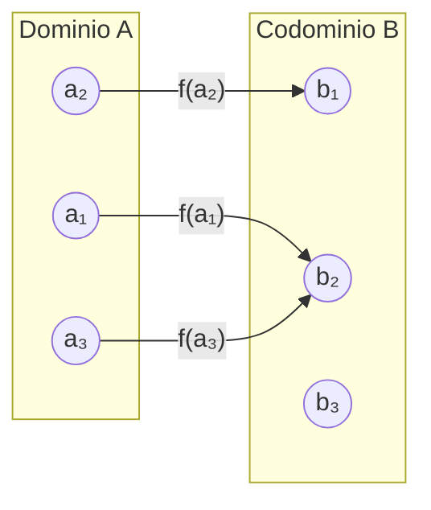
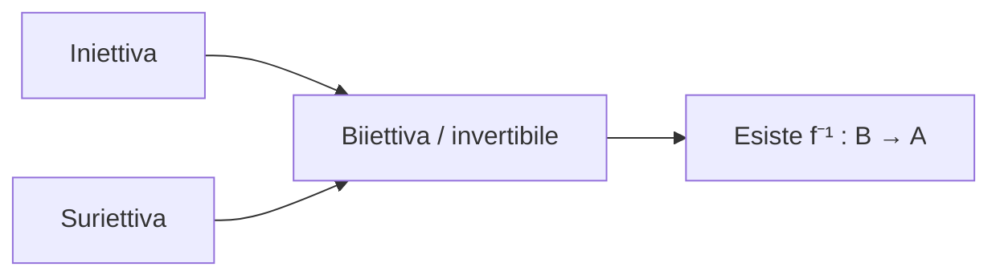

# Insiemi e funzioni

## Insiemi numerici

I principali insiemi numerici sono:

- $\mathbb{N}$, insieme dei numeri naturali: $0,1,2,\ldots$;
- $\mathbb{Z}$, insieme dei numeri interi: $\ldots,-2,-1,0,1,2,\ldots$;
- $\mathbb{Q}$, insieme dei numeri razionali:
  $$
  \mathbb{Q}=\left\{\frac{p}{q}:p,q\in\mathbb{Z},\ q\neq 0\right\};
  $$
- $\mathbb{R}$, insieme dei numeri reali.

Vale la catena di inclusioni

$$
\mathbb{N}\subset\mathbb{Z}\subset\mathbb{Q}\subset\mathbb{R}.
$$

I numeri **razionali** sono quelli esprimibili come rapporto tra due interi. I numeri reali comprendono i razionali e anche gli **irrazionali**, come $\sqrt{2}$, che non può essere scritto come frazione. Per esempio,

$$
\frac{1}{2}\in\mathbb{Q},
\qquad
\sqrt{2}\in\mathbb{R}\setminus\mathbb{Q}.
$$

## Intervalli di $\mathbb{R}$

Un insieme $I\subseteq\mathbb{R}$ è un **intervallo** se, per ogni $x,y\in I$ con $x<y$, ogni numero $z$ compreso tra $x$ e $y$ appartiene a $I$:

$$
x<z<y\quad\Longrightarrow\quad z\in I.
$$

Ad esempio,

$$
I=\{x\in\mathbb{R}:x\neq 0\}
$$

non è un intervallo, perché non contiene il punto $0$ che separa i suoi elementi positivi e negativi.

Per $a,b\in\mathbb{R}$, con $a<b$, si usano le seguenti notazioni:

$$
\begin{aligned}
[a,b]&=\{x\in\mathbb{R}:a\le x\le b\} &&\text{intervallo chiuso},\\
(a,b)&=\{x\in\mathbb{R}:a<x<b\} &&\text{intervallo aperto},\\
[a,b)&=\{x\in\mathbb{R}:a\le x<b\} &&\text{intervallo aperto a destra},\\
(a,b]&=\{x\in\mathbb{R}:a<x\le b\} &&\text{intervallo aperto a sinistra}.
\end{aligned}
$$

Gli intervalli illimitati sono, ad esempio,

$$
[a,+\infty)=\{x\in\mathbb{R}:x\ge a\},
\qquad
(a,+\infty)=\{x\in\mathbb{R}:x>a\}.
$$

Inoltre,

$$
(-\infty,+\infty)=\mathbb{R}.
$$

## Funzioni

Una **funzione** è una terna $(A,B,f)$, indicata con

$$
f:A\longrightarrow B,
$$

dove:

- $A$ è il **dominio**;
- $B$ è il **codominio**;
- a ogni elemento di $A$ viene associato uno e un solo elemento di $B$.

Il diagramma seguente rappresenta una funzione: ogni elemento del dominio ha esattamente una freccia uscente.

### Grafico di una funzione

Il **grafico** di $f$ è l'insieme

$$
\operatorname{graph}(f)=\{(a,b)\in A\times B:b=f(a)\}.
$$

Per esempio, se $f(x)=2x$, allora

$$
f(3)=6,
$$

quindi $(3,6)\in\operatorname{graph}(f)$, mentre $(3,7)\notin\operatorname{graph}(f)$.

### Immagine di un sottoinsieme

Sia $f:A\to B$ una funzione e sia $D\subseteq A$. L'immagine di $D$ tramite $f$ è

$$
f(D)=\{f(x):x\in D\}.
$$

Se $D=A$, si scrive semplicemente

$$
\operatorname{Im}(f)=f(A).
$$

Ad esempio, per $f(x)=x^2$:

$$
\operatorname{Im}(f)=[0,+\infty)
$$

se il dominio è $\mathbb{R}$, mentre, restringendo il dominio a $D=[1,3]$, si ottiene

$$
f(D)=[1,9].
$$

## Proprietà delle funzioni

### Funzione iniettiva

Una funzione $f:A\to B$ è **iniettiva** se elementi distinti del dominio hanno immagini distinte:

$$
\forall x_1,x_2\in A,\quad x_1\neq x_2
\Longrightarrow f(x_1)\neq f(x_2).
$$

Equivalentemente,

$$
f(x_1)=f(x_2)\Longrightarrow x_1=x_2.
$$

### Funzione suriettiva

Una funzione $f:A\to B$ è **suriettiva** se ogni elemento del codominio è immagine di almeno un elemento del dominio:

$$
\forall y\in B\ \exists x\in A\text{ tale che }f(x)=y.
$$

In modo equivalente,

$$
\operatorname{Im}(f)=B.
$$

### Funzione biiettiva

Una funzione $f:A\to B$ è **biiettiva**, o **invertibile**, se è contemporaneamente iniettiva e suriettiva.

In questo caso esiste una funzione inversa

$$
f^{-1}:B\longrightarrow A
$$

tale che

$$
f^{-1}(f(a))=a
\qquad\text{e}\qquad
f(f^{-1}(b))=b.
$$

Equivalentemente,

$$
f^{-1}(b)=a\Longleftrightarrow f(a)=b.
$$

### Esempio: il quadrato su $[0,+\infty)$

Consideriamo

$$
f:[0,+\infty)\longrightarrow[0,+\infty),
\qquad f(x)=x^2.
$$

Su questo dominio la funzione è biiettiva. La sua inversa è

$$
f^{-1}(y)=\sqrt{y}.
$$

## Simmetria rispetto alla retta $y=x$

Il grafico di una funzione inversa si ottiene per simmetria rispetto alla retta bisettrice.  

$$
y=x.
$$

Nel disegno sono rappresentati, come esempio, i grafici di $y=\sqrt{x}$ e
$y=x^2$ (nel tratto in cui $x\ge 0$): sono simmetrici rispetto a $y=x$.

  

## Nota sulla radice di potenze  

È importante distinguere:

$$
\sqrt{x^2}=|x|,
$$

non $x$ per ogni $x\in\mathbb{R}$. Infatti la radice quadrata indica sempre la soluzione non negativa:

$$
\sqrt{9}=3,
$$

mentre dall'equazione

$$
x^2=9
$$

si ricava

$$
x=3\quad\text{oppure}\quad x=-3.
$$

Il grafico di $y=\sqrt{x^2}=|x|$ è quindi formato da due semirette, non dalla retta $y=x$ intera.

## Operazioni grafiche sulle funzioni

Data una funzione $f$, si possono ottenere nuove funzioni tramite trasformazioni del suo grafico.

| Funzione | Trasformazione del grafico |
|---|---|
| $g(x)=f(x)+a$ | Traslazione verticale di ampiezza $a$ |
| $g(x)=f(x+a)$ | Traslazione orizzontale di ampiezza $a$ |
| $g(x)=\|f(x)\|$ | Le parti sotto l'asse $x$ vengono riflesse sopra l'asse $x$ |
| $g(x)=-f(x)$ | Simmetria rispetto all'asse $x$ |
| $g(x)=f(-x)$ | Simmetria rispetto all'asse $y$ |
| $g(x)=-f(-x)$ | Simmetria centrale rispetto all'origine |

Nel caso della traslazione orizzontale, il segno va interpretato con attenzione: $f(x+a)$ sposta il grafico verso sinistra di $a$, mentre $f(x-a)$ lo sposta verso destra di $a$.
