## Simmetria rispetto alla retta $y=x$

Il grafico di una funzione inversa si ottiene per simmetria rispetto alla retta

$$
y=x.
$$

Nel disegno sono rappresentati, come esempio, i grafici di $y=\sqrt{x}$ e
$y=x^2$ (nel tratto in cui $x\ge 0$): sono simmetrici rispetto a $y=x$.

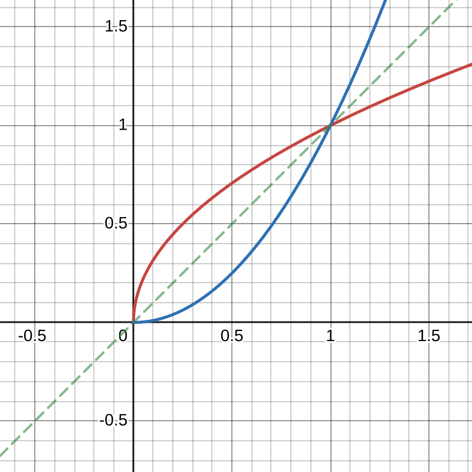  

## Funzioni monotone

Siano $A,B\subseteq\mathbb{R}$ e sia $f:A\to B$. Per ogni $x_1,x_2\in A$ con
$x_1<x_2$:

- se $f(x_1)<f(x_2)$, $f$ è **strettamente crescente**;
- se $f(x_1)\le f(x_2)$, $f$ è **debolmente crescente** (o non decrescente);
- se $f(x_1)>f(x_2)$, $f$ è **strettamente decrescente**;
- se $f(x_1)\ge f(x_2)$, $f$ è **debolmente decrescente** (o non crescente).

Una funzione è **monotona** se è crescente oppure decrescente, in senso stretto
o debole. In figura una funzione debolmente crescente.  

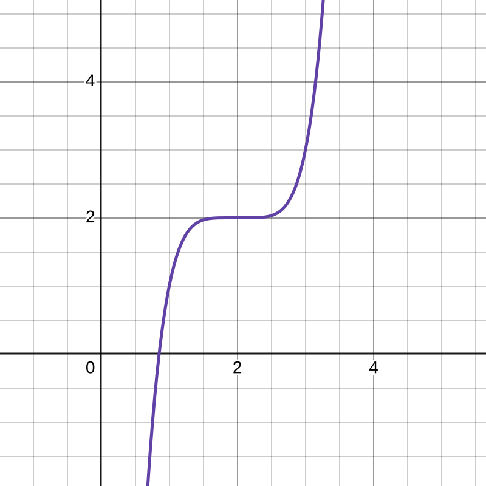  

In figura una funzione non monotona.  
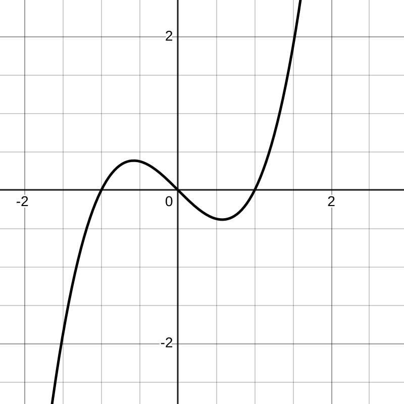  

### Osservazioni

- Se $f$ è strettamente crescente, allora è anche debolmente crescente.
- Se $f$ è strettamente decrescente, allora è anche debolmente decrescente.
- Il viceversa non vale: una funzione debolmente crescente può avere tratti
  costanti e quindi non essere strettamente crescente.
- Una funzione che prima cresce e poi decresce, o viceversa, non è monotona sul
  suo intero dominio.

La funzione $f(x)=\frac1x$, con dominio $\mathbb{R}\setminus\{0\}$, non è
monotona su tutto il dominio; è però strettamente decrescente separatamente su
$(0,+\infty)$ e su $(-\infty,0)$.  

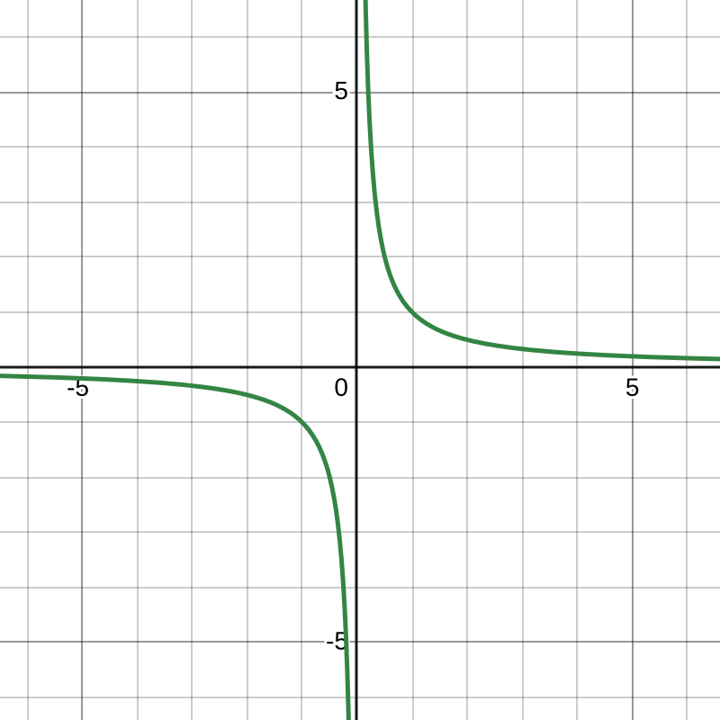  

Se $f$ è strettamente crescente e $x_1<x_2$, allora

$$
f(x_1)<f(x_2).
$$

Se è strettamente decrescente, l’ordinamento viene invertito:

$$
x_1<x_2\quad\Longrightarrow\quad f(x_1)>f(x_2).
$$

In termini di rapporto incrementale, la crescita corrisponde a un coefficiente
positivo:

$$
f\text{ crescente}
\quad\Longleftrightarrow\quad
\frac{f(x_2)-f(x_1)}{x_2-x_1}>0
$$

per $x_1<x_2$ (e analogamente il rapporto è negativo nel caso decrescente).  

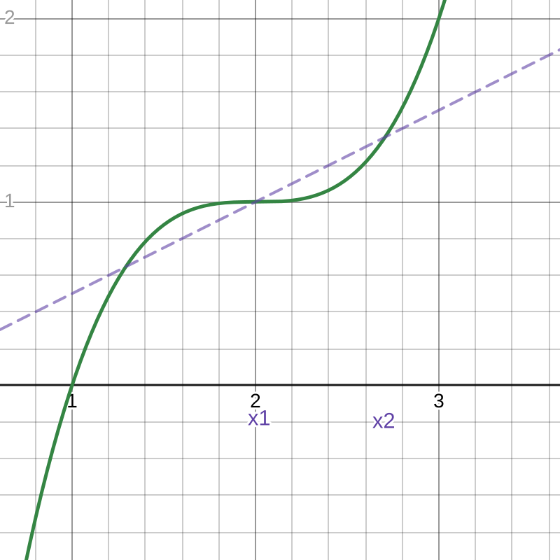  

## Composizione di funzioni

Siano $A,B,C\subseteq\mathbb{R}$ e siano

$$
f:A\to B,
\qquad
g:B\to C.
$$

La composizione $g\circ f:A\to C$ è definita da

$$
(g\circ f)(x)=g(f(x)).
$$

Per la monotonia valgono le seguenti regole:

1. se $f$ è crescente e $g$ è crescente, allora $g\circ f$ è crescente;
2. se $f$ è crescente e $g$ è decrescente, allora $g\circ f$ è decrescente;
3. se $f$ è decrescente e $g$ è decrescente, allora $g\circ f$ è crescente.

In generale, ogni composizione in cui compare una sola funzione decrescente è
decrescente; con due funzioni decrescenti l’ordinamento viene invertito due
volte e quindi la composizione è crescente.

Esempio:

$$
f(x)=x^3,
\qquad
g(t)=e^t,
$$

perciò

$$
(g\circ f)(x)=g(f(x))=e^{x^3}.
$$

Entrambe le funzioni sono strettamente crescenti, quindi anche $e^{x^3}$ è
strettamente crescente.

## Funzioni pari e dispari

Sia $A\subseteq\mathbb{R}$ **simmetrico rispetto all’origine** (per determinare la parita' e' indispensabile che il suo dominio sia un insieme simmetrico rispetto all'origine), cioè

$$x\in A\quad\Longleftrightarrow\quad -x\in A$$  

Sia inoltre $f:A\to\mathbb{R}$.

- $f$ è **pari** se

  $$f(-x)=f(x)\qquad\forall x\in A$$

- $f$ è **dispari** se

  $$f(-x)=-f(x)\qquad\forall x\in A$$

Il grafico di una funzione pari è simmetrico rispetto all’asse $y$; il grafico di
una funzione dispari è simmetrico rispetto all’origine. Esempi sono $f(x)=x^2$
(pari) e $f(x)=x^3$ (dispari).

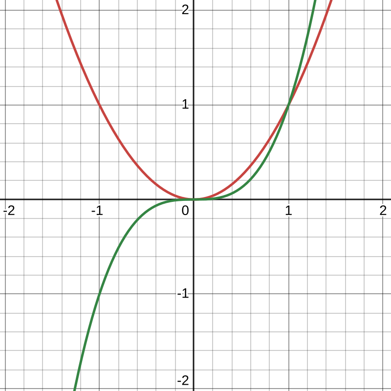  

## Funzioni periodiche

Siano $A\subseteq\mathbb{R}$ e $p\in\mathbb{R}$ tali che

$$
x\in A\quad\Longleftrightarrow\quad x+p\in A.
$$

La funzione $f:A\to\mathbb{R}$ si dice **periodica di periodo $p$** se

$$
f(x+p)=f(x)\qquad\forall x\in A.
$$

Il periodo è una lunghezza che si ripete lungo l’asse $x$. Le funzioni seno e
coseno hanno periodo $2\pi$:

$$
\sin(x+2\pi)=\sin x,
\qquad
\cos(x+2\pi)=\cos x.
$$

La tangente ha periodo $\pi$:

$$
\tan(x+\pi)=\tan x,
\qquad
\tan x=\frac{\sin x}{\cos x}.
$$

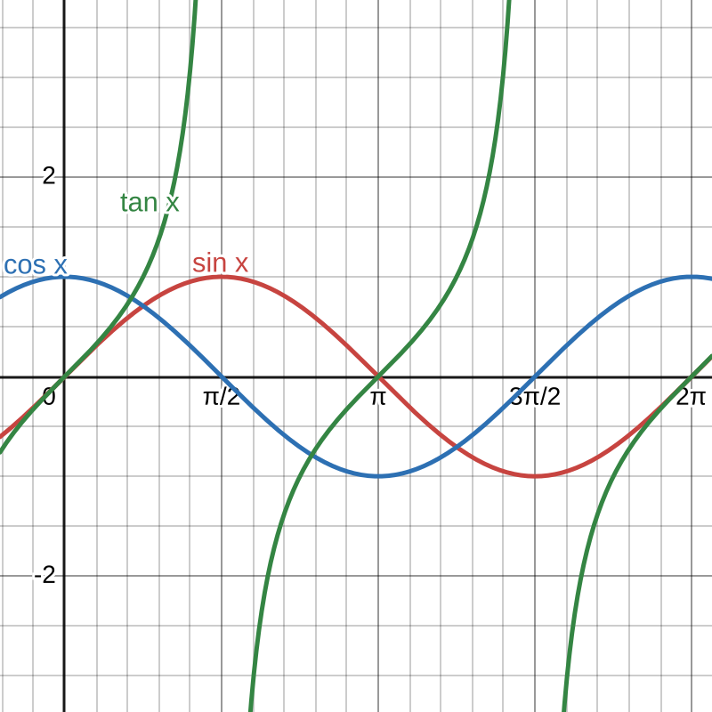  

## Funzioni elementari

### Funzione affine

Una funzione affine ha la forma

$$
f(x)=ax+b,
\qquad a,b\in\mathbb{R}.
$$

Il suo grafico è una retta. Il coefficiente $a$ è il coefficiente angolare,
mentre $b$ è l’intercetta sull’asse $y$. Se $a>0$ la funzione è crescente; se
$a<0$ è decrescente; se $a=0$ è costante. Al contrario dell'equazione di una retta non e' mai possibile rappresentare una retta verticale in quanto violerebbe la definizione di funzione.  

### Funzioni potenza

Per $k\in\mathbb{N}$, una funzione potenza è

$$
f(x)=x^k.
$$

Se $k$ è dispari, il grafico è simmetrico rispetto all’origine; se $k$ è pari,
è simmetrico rispetto all’asse $y$.

Per esponenti **interi negativi**,

$$
f(x)=x^k,\qquad k\in\mathbb{Z},\ k<0,
$$

il dominio esclude $0$ in quanto:  

$$
x^{-3}=\frac1{x^3}.
$$

Per $q\in\mathbb{N}$,

$$
f(x)=x^{\frac{1}{q}}=\sqrt[q]{x}.
$$

Se $q$ è pari, il dominio reale è $[0,+\infty)$; se $q$ è dispari, la radice è
definita per ogni $x\in\mathbb{R}$. Per esempio,

$$x^\frac{7}{3}=\sqrt[3]{x^7}$$

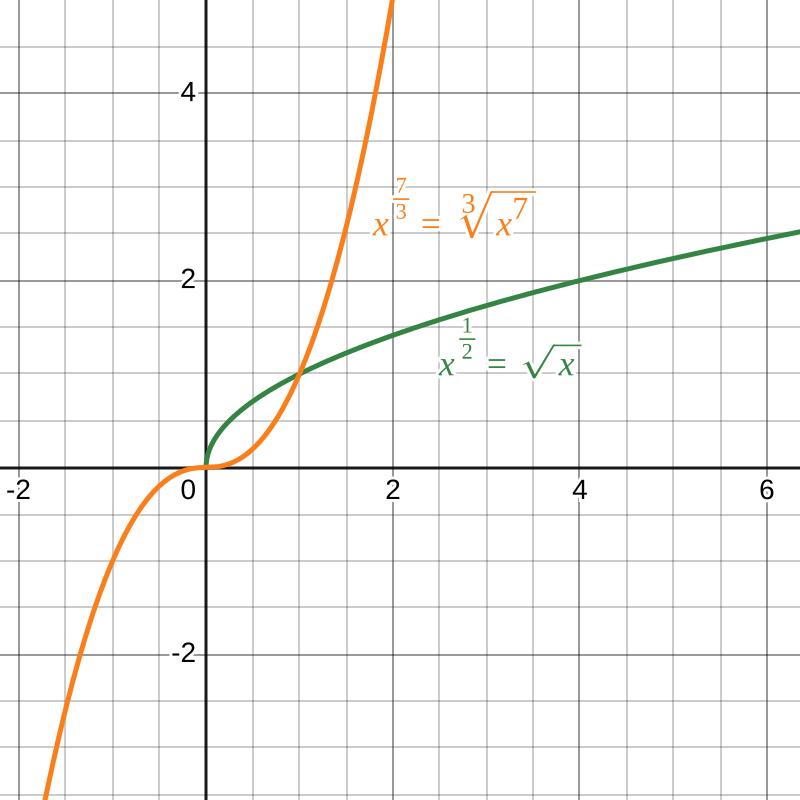  

Se $q$ e' negativo si ha di nuovo che il dominio esclude 0.  

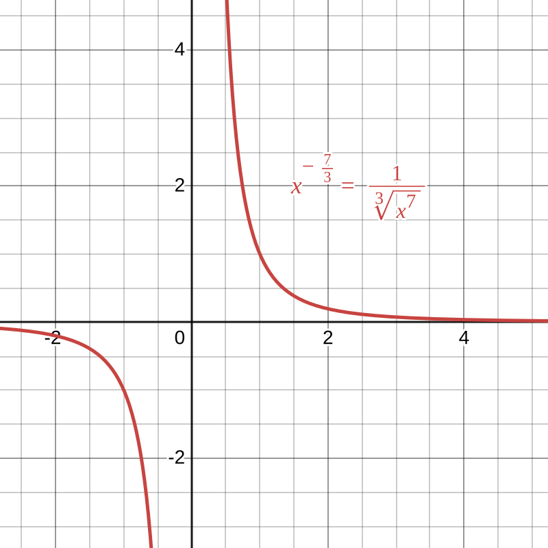  

### Funzione esponenziale

La funzione esponenziale di base $a$ è

$$
f(x)=a^x,
\qquad a>0,\quad a\neq1.
$$

Vale sempre

$$
a^x>0\qquad\forall x\in\mathbb{R}.
$$

Se $a>1$, $a^x$ è strettamente crescente; se $0<a<1$, è strettamente
decrescente. La funzione

$$
f:\mathbb{R}\to(0,+\infty),\qquad f(x)=a^x
$$

è invertibile. La sua inversa è il logaritmo in base $a$:

$$
f^{-1}(x)=\log_a x.
$$

Quando $a=e\simeq 2.718$ si scrive semplicemente $\log x$ o $\ln x$.

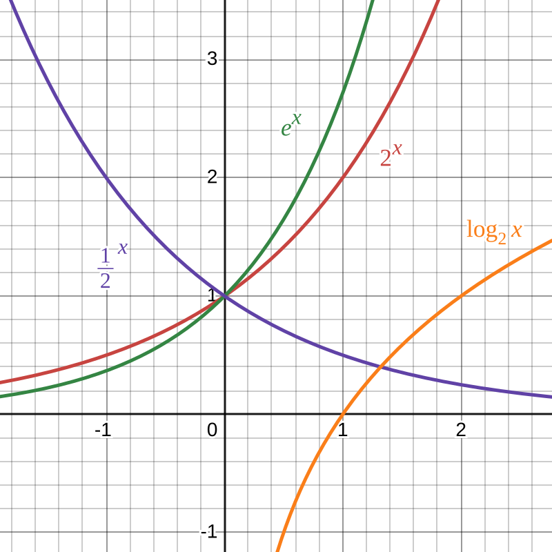  

### Cambio di base dei logaritmi

Per definizione,

$$
\log_a x=y\quad\Longleftrightarrow\quad x=a^y.
$$

Applicando il logaritmo in una base qualunque,

$$
\log x=\log(a^y)=y\log a,
$$

da cui si ottiene la formula del cambio di base:

$$
\boxed{\log_a x=\frac{\log x}{\log a}}.
$$

## Potenze con esponente reale

Per un esponente reale $\alpha\in\mathbb{R}$, la potenza viene definita per
$x>0$ tramite l’esponenziale:

$$
x^\alpha=e^{\alpha\log x}.
$$

Il dominio naturale è quindi $x>0$. Questa definizione permette di dare senso
anche a espressioni come $x^{\sqrt2}$; invece, in generale, $(-x)^\alpha$ non è
definita nei reali quando $\alpha$ è irrazionale.

## Funzioni trigonometriche

La funzione seno assume valori nell’intervallo $[-1,1]$:

$$
-1\le\sin x\le1.
$$

Non è invertibile su tutto $\mathbb{R}$ perché è periodica. Restringendo il
dominio all’intervallo $[-\frac\pi2,\frac\pi2]$, diventa invertibile e si
ottiene la funzione arcoseno:

$$
\sin:\left[-\frac\pi2,\frac\pi2\right]\to[-1,1],
\qquad
\arcsin:[-1,1]\to\left[-\frac\pi2,\frac\pi2\right].
$$

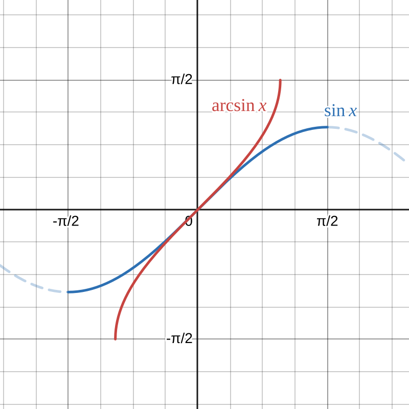  

Analogamente, il coseno viene ristretto a $[0,\pi]$ e la sua inversa è
$\arccos$:

$$
\cos:[0,\pi]\to[-1,1],
\qquad
\arccos:[-1,1]\to[0,\pi].
$$  

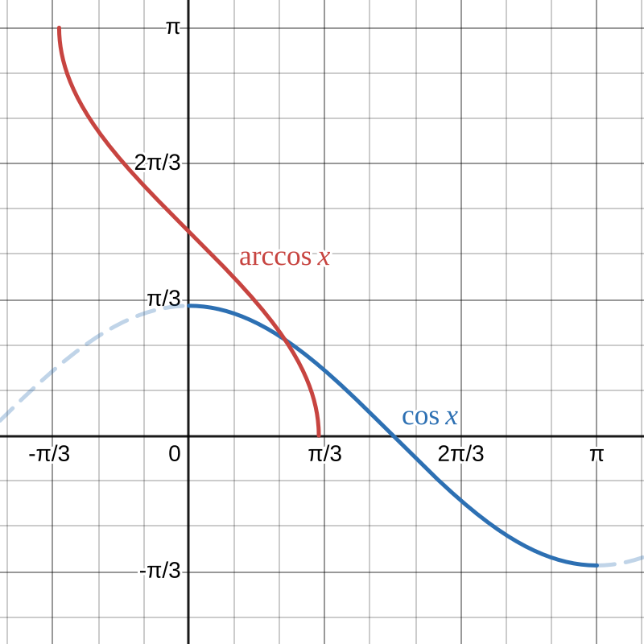  

La tangente è definita da

$$
\tan x=\frac{\sin x}{\cos x},
$$

quindi non è definita dove $\cos x=0$. Restringendo il dominio a
$(-\frac\pi2,\frac\pi2)$, è invertibile e la sua inversa è l’arcotangente:

$$
\tan:\left(-\frac\pi2,\frac\pi2\right)\to\mathbb{R},
\qquad
\arctan:\mathbb{R}\to\left(-\frac\pi2,\frac\pi2\right).
$$  

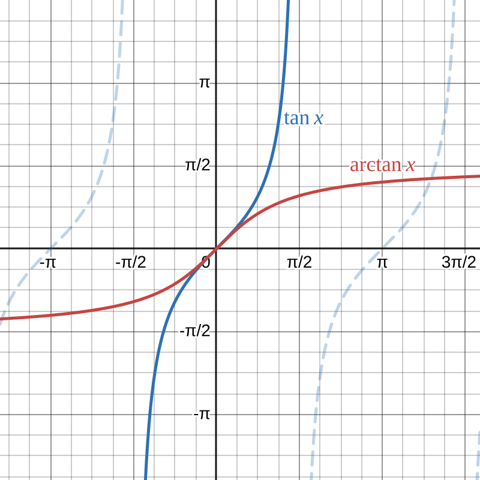  

Infine,

$$
\cot x=\frac{\cos x}{\sin x}=\frac1{\tan x}
$$

quando i rapporti sono definiti.  
