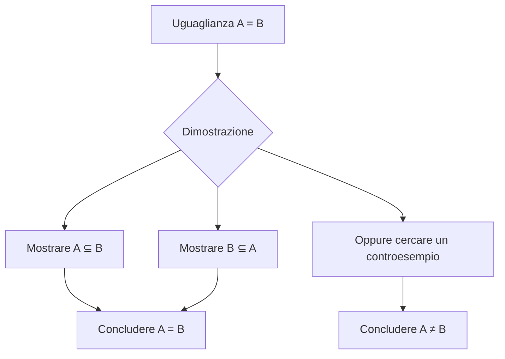

## Operazioni tra insiemi

Siano $A$ e $B$ sottoinsiemi di un insieme universo $U$.

### Unione

L'unione di $A$ e $B$ è l'insieme degli elementi che appartengono ad $A$ oppure a $B$:

$$
A \cup B = \{x \mid x \in A \lor x \in B\}.
$$

Il simbolo logico $\lor$ indica l'operatore booleano **OR**.

### Intersezione

L'intersezione di $A$ e $B$ è l'insieme degli elementi che appartengono contemporaneamente ad $A$ e a $B$:

$$
A \cap B = \{x \mid x \in A \land x \in B\}.
$$

Il simbolo logico $\land$ indica l'operatore booleano **AND**.

### Differenza

La differenza di $A$ e $B$ è l'insieme degli elementi che appartengono ad $A$ ma non a $B$:

$$
A \setminus B = \{x \mid x \in A \land x \notin B\}.
$$

### Complemento

Il complemento di $B$ rispetto all'universo $U$ è:

$$
\overline{B} = \{x \mid x \notin B\}.
$$

La negazione logica si indica con $\neg$ (NOT).

### Esempio

Siano:

$$
A=\{a,b,c\},\qquad B=\{b,c,d\},\qquad U=\{a,b,c,\ldots,y,z\}.
$$

Allora:

$$
\begin{aligned}
A\cup B &= \{a,b,c,d\},\\
A\cap B &= \{b,c\},\\
A\setminus B &= \{a\},\\
B\setminus A &= \{d\},\\
(A\setminus B)\cup(B\setminus A) &= \{a,d\},\\
(A\cup B)\setminus(A\cap B) &= \{a,d\}.
\end{aligned}
$$

Le ultime due espressioni rappresentano la **differenza simmetrica**.

## Corrispondenza con la logica proposizionale

| Insiemi | Logica proposizionale | Significato |
|---|---|---|
| Complemento $\overline{A}$ | $\neg P$ | negazione |
| Intersezione $A\cap B$ | $P\land Q$ | congiunzione |
| Unione $A\cup B$ | $P\lor Q$ | disgiunzione |
| $A\subseteq B$ | $P\Rightarrow Q$ | implicazione |
| $A\supseteq B$ | $P\Leftarrow Q$ | implicazione nel verso opposto |
| $A=B$ | $P\Leftrightarrow Q$ | doppia implicazione |

La tavola di verità dei connettivi logici permette di verificare se una proposizione composta è sempre vera, cioè una tautologia.

L'implicazione va interpretata come una regola: se si verifica la premessa, allora deve essere rispettata la conseguenza. Per esempio: «Se guidi un auto, allora devi avere 18 anni».

## Dimostrazioni di uguaglianze tra insiemi

Data un'uguaglianza tra insiemi, si può procedere in due modi:

1. dimostrare che i due insiemi sono inclusi l'uno nell'altro;
2. trovare un controesempio per dimostrare che l'uguaglianza non è valida.

Per dimostrare un'inclusione si prende un elemento arbitrario $x$ del primo insieme e si mostra che appartiene anche al secondo.

## Dimostrazione della proprietà distributiva

Vogliamo dimostrare la distributività dell'intersezione rispetto all'unione:

$$
A\cap(B\cup C)=(A\cap B)\cup(A\cap C).
$$

### Dimostrazione per inclusioni

Dimostriamo prima:

$$
A\cap(B\cup C)\subseteq(A\cap B)\cup(A\cap C).
$$

Sia $x\in A\cap(B\cup C)$. Per definizione di intersezione e unione:

$$
x\in A\quad\land\quad(x\in B\lor x\in C).
$$

Per la proprietà distributiva della logica:

$$
(x\in A\land x\in B)\lor(x\in A\land x\in C).
$$

Quindi:

$$
x\in(A\cap B)\cup(A\cap C).
$$

Si dimostra analogamente l'inclusione opposta:

$$
(A\cap B)\cup(A\cap C)\subseteq A\cap(B\cup C).
$$

Poiché valgono entrambe le inclusioni, per antisimmetria dell'inclusione segue:

$$
A\cap(B\cup C)=(A\cap B)\cup(A\cap C).
$$

### Controesempio

Per mostrare che un'uguaglianza è falsa è sufficiente trovare un controesempio. Ad esempio, l'uguaglianza

$$
(A\cap B)\cup C=A\cap(B\cup C)
$$

non è vera in generale. È possibile scegliere, per esempio, $A=\varnothing$ e $B=C=\{x\}$: il primo membro vale $\{x\}$, mentre il secondo vale $\varnothing$.

## Dimostrazioni grafiche

Nei diagrammi di Eulero–Venn si evidenziano le regioni che appartengono ai due membri dell'uguaglianza. Se le regioni evidenziate coincidono, il diagramma suggerisce l'uguaglianza; la dimostrazione formale giustifica poi il risultato per ogni elemento arbitrario.

Il diagramma è quindi utile come intuizione e controllo preliminare, mentre la dimostrazione per elementi o per inclusioni fornisce la giustificazione generale.
