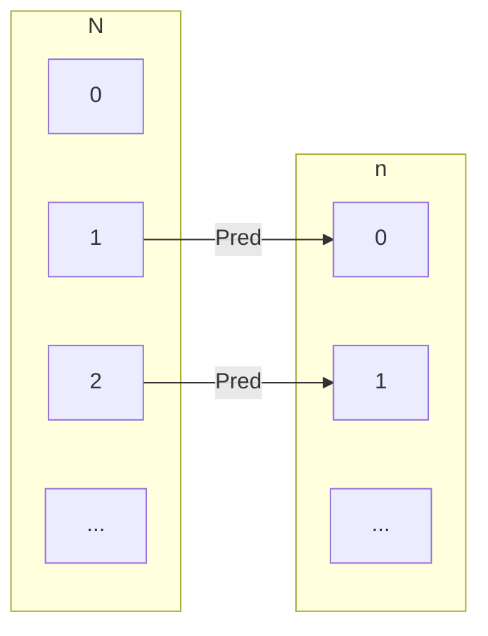
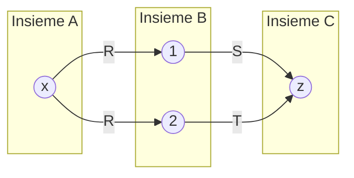
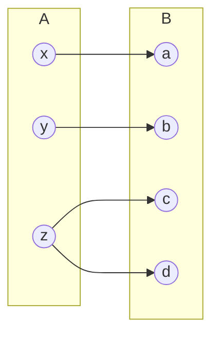
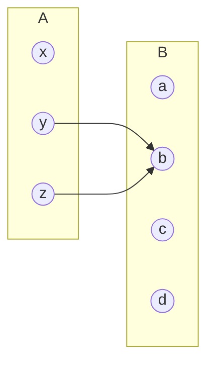

# Relazione Opposta

Dato $R: A \leftrightarrow B$, la **relazione opposta** $R^{op}: B \leftrightarrow A$ inverte l'ordine di ogni coppia:

$$R^{op} = \{(y, x) \in B \times A \mid (x, y) \in R\}$$

### Esempi

* **Genitore**: $\text{Genitore}^{op} = \text{Figlio/a}$
* **Successore**: $\text{Succ}^{op} = \text{Pred}$ (Predecessore, dove $y = x - 1$)




$Succ^{op} = \{(y,x) \in \mathbb{N}\times\mathbb{N}\ |\ (x,y)\in Succ\}$  

# Relazione Opposta e Composizione

$A = \{x, y, z\}$  
$B = \{a, b, c, d\}$  
$C = \{1, 2\}$  

$R = \{(x,a), (y,b), (z,c), (z,d)\}: A \leftrightarrow B$  
$S = \{(a,1), (a,2), (c,2), (d,2)\}: B \leftrightarrow C$  

$R; S = \{(x,1), (x,2), (z,2)\}: A \leftrightarrow C$  

$R^{op} = \{(a,x), (b,y), (c,z), (d,z)\}: B \leftrightarrow A$  
$S^{op} = \{(1,a), (2,a), (2,c), (2,d)\}: C \leftrightarrow B$  


L'opposto della composizione e' quindi...  

$(R; S)^{op} = S^{op}; R^{op} = \{(1,x), (2,x), (2,z)\}$  

## Leggi di Distributivita'

| Nome | Formula |
| :--- | :--- |
| **Distributività $;$ su $\cup$ (sinistra)** | $R ; (S \cup T) = (R ; S) \cup (R ; T)$ |
| **Distributività $;$ su $\cup$ (destra)** | $(S \cup T) ; U = (S ; U) \cup (T ; U)$ |
| **Distributività $^{op}$ su $;$** | $(R ; S)^{op} = S^{op} ; R^{op}$ |
| **Distributività $^{op}$ su $\cup$** | $(S \cup T)^{op} = S^{op} \cup T^{op}$ |
| **Distributività $^{op}$ su $\cap$** | $(S \cap T)^{op} = S^{op} \cap T^{op}$ |
| **Distributività $^{op}$ su complementare** | $(\overline{R})^{op} = \overline{R^{op}}$ |


## Distributivita' su `U` sinistra  

Per tutte le relazioni $R: A \leftrightarrow B$, $S: B \leftrightarrow C$ e $T: B \leftrightarrow C$ vale:

$$R ; (S \cup T) = (R ; S) \cup (R ; T) : A \leftrightarrow C$$  

#### Dimostrazione:

$$(a, c) \in R ; (S \cup T) \equiv \{\text{def di } ;\}$$  

$$(\exists b \in B . \, (a, b) \in R \land (b, c) \in S \cup T) \equiv \{\text{def di } \cup\}$$  

$$(\exists b \in B . \, (a, b) \in R \land ((b, c) \in S \lor (b, c) \in T))\equiv \{\text{distr. } \land \text{ su } \lor, \text{ distr. } \exists \text{ su } \lor\}$$  

$$(\exists b \in B . \, (a, b) \in R \land (b, c) \in S) \lor (\exists b \in B . \, (a, b) \in R \land (b, c) \in T) \equiv \{\text{def di } ;\}$$  

$$((a, c) \in R ; S) \lor ((a, c) \in R ; T) \equiv \{\text{def di } \cup\}$$  

$$(a, c) \in (R ; S) \cup (R ; T)$$  


## La distributività vale per l' (intersezione)? (NO!)

### Controesempio:

Definiamo gli insiemi e le relazioni come mostrato nel diagramma:



Allora si ha che:  

$S \cap T = \varnothing$  
$R;S = \{(x, z)\} = R;T$  

$R;(S\cap T) = \varnothing$  
$(R;S)\cap(R;T) = \{(x, z)\}$  

$R;(S\cap T) \ne (R;S)\cap(R;T)$  


# TUSI - Proprieta' di relazioni

## Relazioni totali

Dati due insiemi $A$ e $B$ una relazione $R: A \leftrightarrow B$ e' totale se:

> per tutti gli $a \in A$ esiste **almeno un** $b \in B$ tale che $(a, b) \in R$
> 
> $$(\forall a \in A . \, (\exists b \in B . \, (a, b) \in R))$$

In parole povere, ogni elemento di `A` si collega almeno ad uno o piu' elementi di `B`.  

Consideriamo...  

$A = \{x, y, z\}$  
$B = \{a, b, c, d\}$  
$R = \{(x, a), (y, b), (z, c), (z, d)\}$  

...allora `R` e' totale!  

  ```mermaid
  flowchart LR
      subgraph A["A"]
          x((x))
          y((y))
          z((z))
      end

      subgraph B["B"]
          a((a))
          b((b))
          c((c))
          d((d))
      end

      x --> a
      y --> b
      z --> c
      z --> d
```

|Relazioni|Totale ?|
|-|-|
|$Id_A : A \leftrightarrow A$|si $\checkmark$|
|$A\times B: A \leftrightarrow B$| si se $B \ne \varnothing$|
|$\varnothing: A \leftrightarrow B$| si se $A = \varnothing$|

> Se $A = \varnothing$ allora la premessa della proprieta' e' falsa e non c'e' nessun elemento da controllare per cui e' totale per definizione.  

# Relazioni univalenti

Dati due insiemi $A$ e $B$, una relazione $R: A \leftrightarrow B$ e' **univalente** se:

> **per tutti gli $a \in A$ esiste al piu' un $b \in B$ tale che $(a, b) \in R$**
> 
> $$(\forall a \in A . \, (\forall b, b' \in B . \, (a, b) \in R \land (a, b') \in R \Rightarrow b = b'))$$

In parole povere, ogni elemento di `A` si collega al massimo ad un elemento di `B`, quindi zero o un collegamento.  

Consideriamo $A = \{x, y, z\}$ e $B = \{a, b, c, d\}$  

$R = \{(x, a), (y, b), (z, c), (z, d)\}$ $\implies$ **Non univalente**, $z$ ha più immagini: $c$ e $d$



La seguente relazione e' invece univalente in quanto ogni elemento di `A` e' in collegamento con zero oppure un solo elemento di `B`.  



|Relazioni|Univalente ?|
|-|-|
|$Id_A : A \leftrightarrow A$|si $\checkmark$|
|$A\times B: A \leftrightarrow B$| si se $A = \varnothing$ oppure $B \ne \varnothing$ oppure $B$ e' un singoletto|
|$\varnothing: A \leftrightarrow B$| si $\checkmark$|

# Relazioni suriettive

Dati due insiemi $A$ e $B$, una relazione $R: A \leftrightarrow B$ e' **suriettiva** se:

> **per tutti i $b \in B$ esiste almeno un $a \in A$ tale che $(a, b) \in R$**
> 
> $$(\forall b \in B . \, (\exists a \in A . \, (a, b) \in R))$$


Consideriamo $A = \{x, y, z\}$ e $B = \{a, b, c, d\}$  


$R = \{(x, a), (y, b), (z, c), (z, d)\}\implies$ **Suriettiva**, ogni elemento di $B$ e' raggiunto da almeno una freccia  


In parole povere la suriettivita' e' la totalita' da `B` verso `A`, infatti:  
> Una funzione $f: A \to B$ e' suriettiva se e solo se la sua relazione inversa $f^{-1}: B \to A$ e' totale

|Relazioni|Suriettiva ?|
|-|-|
|$Id_A : A \leftrightarrow A$|si $\checkmark$|
|$A\times B: A \leftrightarrow B$| si se $A \ne \varnothing$ o se $B = \varnothing$|
|$\varnothing: A \leftrightarrow B$| si se $B = \varnothing$|

# Relazioni iniettive

Dati due insiemi $A$ e $B$, una relazione $R: A \leftrightarrow B$ e' **iniettiva** se:

> **per tutti i $b \in B$ esiste al piu' un $a \in A$ tale che $(a, b) \in R$**
> 
> $$(\forall b \in B . \, (\forall a, a' \in A . \, (a, b) \in R \land (a', b) \in R \Rightarrow a = a'))$$


Consideriamo $A = \{x, y, z\}$ e $B = \{a, b, c, d\}$  

$R = \{(x, a), (y, b), (z, c), (z, d)\}\implies$ **Iniettiva**, nessun elemento di $B$ ha piu' di una freccia in ingresso


In parole povere l'iniettivita' e' l'univalenza da `B` verso `A`

> Una funzione $f: A \to B$ e' iniettiva se e solo se la sua relazione inversa $f^{-1}: B \to A$ e' univalente


|Relazioni|Iniettiva ?|
|-|-|
|$Id_A : A \leftrightarrow A$|si $\checkmark$|
|$A\times B: A \leftrightarrow B$| si se $A = \varnothing$ o $A$ e' un singoletto, oppure se $B = \varnothing$|
|$\varnothing: A \leftrightarrow B$| si $\checkmark$|

# Le proprieta' di relazioni "TUSI"

$R: A \leftrightarrow B$  

| | partenza ($A$) | arrivo ($B$) |
| :--- | :---: | :---: |
| **almeno** | TOTALE | SURGETTIVA |
| **al più** | UNIVALENTE | INIETTIVA |


## Risultati di dualita'

Per tutti gli insiemi $A$ e $B$, per tutte le relazioni $R: A \leftrightarrow B$:  

* $R$ e' **totale** se e solo se $R^{op}: B \leftrightarrow A$ e' **surgettiva**
* $R$ e' **univalente** se e solo se $R^{op}: B \leftrightarrow A$ e' **iniettiva**
* $R$ e' **surgettiva** se e solo se $R^{op}: B \leftrightarrow A$ e' **totale**
* $R$ e' **iniettiva** se e solo se $R^{op}: B \leftrightarrow A$ e' **univalente**


# Teorema di caratterizzazione  

| Proprietà | Caratterizzazione Algebrica | Significato Intuitivo |
| :--- | :--- | :--- |
| **TOTALE** | $Id_A \subseteq R ; R^{op}$ | Da ogni elemento di $A$ si puo' fare andata ($R$) e ritorno ($R^{op}$) su se stessi. |
| **INIETTIVA** | $R ; R^{op} \subseteq Id_A$ | Facendo andata ($R$) e poi ritorno ($R^{op}$) da $A$, non si puo' finire su elementi diversi da quello di partenza. |
| **UNIVALENTE** | $R^{op} ; R \subseteq Id_B$ | Facendo ritorno ($R^{op}$) e poi andata ($R$) da $B$, non si puo' finire su elementi diversi da quello di partenza. |
| **SURGETTIVA** | $Id_B \subseteq R^{op} ; R$ | Da ogni elemento di $B$ si puo' fare ritorno ($R^{op}$) e poi andata ($R$) su se stessi. |


### Intuizione per l'equivalenza  

Il teorema dice che...  

> $R$ e' univalente $\iff R^{op} ; R \subseteq Id_B$  

#### Osservazioni  

1. Se $R$ e' univalente allora ogni elemento di $A$ ha al massimo una freccia verso $B$
2. Il percorso $R^{op};R$: parte da un elemento $b \in B$ e torna in $A$ con la relazione opposta $R^{op}$, poi vai di nuovo in $B$ con $R$

Quindi, tornato in $A$, esiste una sola freccia per arrivare di nuovo in $B$ ritornando obbligatoriamente al punto di partenza $b$.  

Prendiamo come esempio $A = \{x\}$ e $B = \{1, 2\}$ e la relazione univalente $R = \{(x, 1)\}$. L'elemento $2 \in B$ non ha frecce. L'identita' e': $Id_B = \{(1, 1), (2, 2)\}$  
Calcoliamo la composizione:  

$R^{op} ; R = \{(1, 1)\}$  

Otteniamo che $\{(1, 1)\} \subseteq \{(1, 1), (2, 2)\} \quad\checkmark$


Le leggi per le altre proprieta' vengono dimostrate in modo simile e quindi questa e' sufficiente.  
