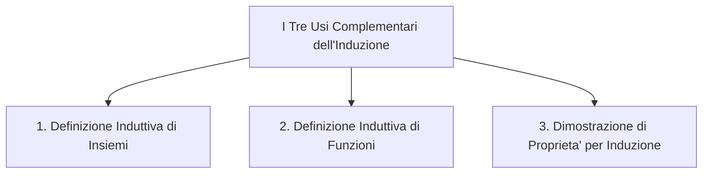

## SQL Queries come operazioni su relazioni

**Tabella: SEGUE**
| Studente | Corso |
| :--- | :--- |
| Mario | Informatica |
| Mario | Analisi 1 |
| Laura | Informatica |
| Pietro | Fisica |

**Tabella: INSEGNA**
| Professore | Corso |
| :--- | :--- |
| Neri | Informatica |
| Bianchi | Analisi 1 |
| Gialli | Fisica |

Nelle basi di dati e nella teoria delle relazioni, le interrogazioni (query) possono essere viste come composizioni di relazioni fondamentali:

**Quali professori ha ciascun studente?**  

$\text{segue};\text{insegna}^{op}$  

**Quali studenti ha ciascun professore?**  

$\text{insegna};\text{segue}^{op}$
  

## Associativita' e isomorfismo nel prodotto cartesiano
Consideriamo tre insiemi $A, B, C$. Formalmente, i prodotti cartesiani:
$$(A \times B) \times C \quad \text{e} \quad A \times (B \times C)$$
**non sono identici**, poiche' gli elementi del primo sono della forma $((a, b), c)$ mentre quelli del secondo sono $(a, (b, c))$.

Tuttavia, sono **isomorfi** ($\cong$): le strutture differiscono solo per le parentesi, ma contengono gli stessi dati grazie a una conversione perfetta e reversibile (bigezione):  

$$(A \times B) \times C \cong A \times (B \times C)$$

Per dimostrare formalmente l'isomorfismo, definiamo le due funzioni di bigezione $i$ e $j$:
* $i: (A \times B) \times C \to A \times (B \times C) \quad \text{con } i(((a, b), c)) = (a, (b, c))$
* $j: A \times (B \times C) \to (A \times B) \times C \quad \text{con } j((a, (b, c))) = ((a, b), c)$

Occorre verificare le due identità:
1. $id_{(A \times B) \times C} = i;j$
2. $id_{A \times (B \times C)} = j;i$

## Triple, $n$-uple e Sequenze
Poiche' gli insiemi sono isomorfi, possiamo "appiattire" e ignorare le parentesi annidate definendo direttamente l'insieme delle **triple**:
$$A \times B \times C = \{ (a, b, c) \mid a \in A, b \in B, c \in C \}$$

Estendendiamo allora il concetto per l'insieme di una generica **n-upla** per ogni $n \in \mathbb{N}$. Per $n = 0$ ad esempio, abbiamo la **tupla vuota**: $()$.

## Sequenza di lunghezza fissata $n$ su un insieme $A$  

Una sequenza su $A$ di lunghezza $n$ e' una **n-upla** $(a_0, a_1, \dots, a_{n-1})$ dove $a_i \in A$ per ogni indice $i \in \{0, \dots, n-1\}$.  

$$A^n = \{ (a_0, a_1, \dots, a_{n-1}) \mid \forall i \in \{0, \dots, n-1\}, a_i \in A \}$$

Esempio:  

Se $A = \{a, b\}$:
* $A^0 = \{()\}$
* $A^1 = \{(a), (b)\}$
* $A^2 = \{(a,a), (a,b), (b,a), (b,b)\}$

## Sequenze di Lunghezza Arbitraria
Consideriamo la famiglia di insiemi delle sequenze di ogni lunghezza possibile $\{ A^i \mid i \in \mathbb{N} \}$.

L'operatore $A^\star$ definisce l'unione infinita di tutte le $n$-uple:  

$$A^* = \bigcup_{i \in \mathbb{N}} A^i = A^0 \cup A^1 \cup A^2 \cup \dots$$

* **Applicazione pratica:** Se $AN$ e' l'insieme dei caratteri alfanumerici, allora $AN^*$ rappresenta **l'insieme di tutte le possibili stringhe** composte da caratteri alfanumerici.
* **Esempio particolare:** Se $1 = \{0\}$, allora $1^* = \{ (), (0), (0,0), (0,0,0), \dots \}$.

---

# Insiemi Infiniti e Definizioni Induttive

### Perche' serve la definizione induttiva?
La classica definizione informale dei numeri naturali:
$$\mathbb{N} = \{0, 1, 2, 3, \dots\}$$
non e' rigorosa: un elaboratore/programma non puo' interpretare correttamente i punti di sospensione ($\dots$).

L'**induzione** fornisce un metodo matematico formale per definire insiemi infiniti in modo finito ed esplicito.



---

### Struttura di una Definizione Induttiva di Insieme
Per definire induttivamente un insieme $A$:
1. **Clausola Base (C.B.):** Specifica i primi elementi atomici che appartengono ad $A$.
2. **Clausola Induttiva (C.I.):** Specifica la regola per costruire nuovi elementi di $A$ a partire da elementi gia' appartenenti ad $A$.
3. **Clausola di chiusura:** Specifica che $A$ non contiene altri elementi oltre a quelli generati da 1 e 2 (spesso riassunta nella formula *"$\mathbb{N}$ e' il più piccolo insieme che soddisfa..."* e percio' omessa).

---

### Definizione Induttiva dei Numeri Naturali ($\mathbb{N}$)
$\mathbb{N}$ e' il più piccolo insieme tale che:
1. **C.B.:** $0 \in \mathbb{N}$
2. **C.I.:** Se $n \in \mathbb{N}$, allora $n + 1 \in \mathbb{N}$

#### Verifica di Appartenenza: $\sqrt{9} \in \mathbb{N}$?
Per verificare se $\sqrt{9} = 3 \in \mathbb{N}$, applichiamo le clausole a ritroso:

1. C.B.: $3 = 0$? **No.** $\to$ Applico C.I.: $3 = 2 + 1$. OK se $2 \in \mathbb{N}$.
2. C.B.: $2 = 0$? **No.** $\to$ Applico C.I.: $2 = 1 + 1$. OK se $1 \in \mathbb{N}$.
3. C.B.: $1 = 0$? **No.** $\to$ Applico C.I.: $1 = 0 + 1$. OK se $0 \in \mathbb{N}$.
4. C.B.: $0 = 0$? **Si!** (Clausola Base raggiunta, appartenenza dimostrata).

#### Esempio Negativo: $2.7 \in \mathbb{N}$?
1. C.B.: $2.7 = 0$? No. C.I.: $\to$ $2.7 = 1.7 + 1$ (ok se $1.7 \in \mathbb{N}$)
2. C.B.: $1.7 = 0$? No. C.I.: $\to$ $1.7 = 0.7 + 1$ (ok se $0.7 \in \mathbb{N}$)
3. C.B.: $0.7 = 0$? No. C.I.: $\to$ $0.7 = -0.3 + 1$ (*Proseguendo all'infinito nel campo negativo, non si incontra mai la Clausola Base $0$, quindi $2.7 \notin \mathbb{N}$.*

---

### Altri Esempi di Insiemi Induttivi

#### Numeri Pari:
* **C.B.:** $0 \in \mathbb{N}^p$
* **C.I.:** Se $n \in \mathbb{N}^p \implies n + 2 \in \mathbb{N}^p$

#### Numeri Dispari:
* **C.B.:** $1 \in \mathbb{N}^d$
* **C.I.:** Se $n \in \mathbb{N}^d \implies n + 2 \in \mathbb{N}^d$

---

## Definizione Induttiva di Funzioni

Se un dominio $A$ e' definito induttivamente, possiamo definire in modo induttivo una funzione $f: A \to B$:
1. **Clausola Base:** Fornire il valore esplicito di $f(a)$ per ogni $a$ introdotto nella clausola base di $A$.
2. **Clausola Induttiva:** Fornire una regola per calcolare $f(a)$ applicando $f$ agli elementi di $A$ gia' presunti noti.

> **Nota:** La definizione induttiva garantisce che $f$ sia una **funzione totale** (definita su tutti gli elementi del dominio).

---

### 3.1 Esempio: Successione dei Numeri Triangolari ($T_n$)
I numeri triangolari rappresentano la somma dei primi $n$ numeri naturali:
$$T_n = 1 + 2 + 3 + \dots + n$$

```
Rappresentazione geometrica di T_4 = 10:
*
* *
* * *
* * * *
```

#### Definizione Induttiva di $T_n$:
1. **C.B.:** $T_0 = 0$
2. **C.I.:** $T_{n+1} = T_n + (n + 1)$

#### Esempio di calcolo ($T_4$):
$$T_4 = T_3 + 4 = (T_2 + 3) + 4 = (T_1 + 2) + 7 = (T_0 + 1) + 9 = 0 + 10 = 10$$

#### Formula di Gauss:
$$T_n = \frac{n(n + 1)}{2}$$

---

# Principio di Induzione Matematica

Per dimostrare che una certa proprieta' $P(n)$ vale per tutti i numeri naturali ($\forall n \in \mathbb{N}$):

### Struttura della Dimostrazione
1. **Caso Base (C.B.):** Si dimostra che $P(0)$ è vera.
2. **Passo Induttivo (P.I.):** Si dimostra che $\forall n \in \mathbb{N}$, **assumendo vera l'Ipotesi Induttiva $P(n)$**, segue che $P(n+1)$ e' vera.

#### Regola di Inferenza Formale:
$$\frac{P(0) \quad \quad \forall n \in \mathbb{N}. \, (P(n) \implies P(n+1))}{\forall n \in \mathbb{N}. \, P(n)}$$

---

### Dimostrazione della Formula di Gauss
Vogliamo dimostrare che $P(n) \equiv \left( T_n = \frac{n(n+1)}{2} \right)$ è vera per ogni $n \in \mathbb{N}$.

#### 1. Caso Base: $P(0)$
$$T_0 = \frac{0 \cdot (0 + 1)}{2} \implies 0 = 0 \quad \checkmark \text{ (Vero per def. di } T_0\text{)}$$

#### 2. Passo Induttivo: $P(n) \implies P(n+1)$
* **Ipotesi Induttiva ($P(n)$):** $T_n = \frac{n(n+1)}{2}$
* **Tesi ($P(n+1)$):** $T_{n+1} = \frac{(n+1)(n+2)}{2}$

**Dimostrazione:**  

$$
\begin{aligned}
T_{n+1} &= T_n + (n+1) && \{ \text{def. induttiva di } T_{n+1} \} \\
&= \frac{n(n+1)}{2} + (n+1) && \{ \text{sostituzione dell'Ipotesi Induttiva} \} \\
&= \frac{n(n+1) + 2(n+1)}{2} && \{ \text{fattorizzazione con denominatore comune} \} \\
&= \frac{(n+1)(n+2)}{2} \quad \checkmark
\end{aligned}
$$

La proprieta' $P(n)$ e' dimostrata per ogni $n \in \mathbb{N}$.

---

### Altro Esempio: Somma dei Primi $n$ Numeri Dispari
Sia la successione $S_n$ definita induttivamente come:
1. $S_0 = 0$
2. $S_{n+1} = S_n + 2n + 1$

Vogliamo dimostrare la proprieta' $P(n) \equiv (S_n = n^2)$.

#### 1. Caso Base: $P(0)$
$$S_0 = 0^2 \implies 0 = 0 \quad \checkmark$$

#### 2. Passo Induttivo: $P(n) \implies P(n+1)$
* **Ipotesi Induttiva:** $S_n = n^2$
* **Tesi:** $S_{n+1} = (n+1)^2$

**Dimostrazione:**

$$
\begin{aligned}
S_{n+1} &= S_n + 2n + 1 && \{ \text{per def. induttiva} \} \\
&= n^2 + 2n + 1 && \{ \text{per Ipotesi Induttiva} \} \\
&= (n+1)^2 \quad \checkmark && \{ \text{sviluppo del quadrato di binomio} \}
\end{aligned}
$$
---

### Attenzione ai tranelli dell'induzione
Quando si applica il principio di induzione, occorre fare attenzione che la catena di implicazioni $P(n) \implies P(n+1)$ sia valida per **tutti** i valori di $n$ nel dominio dell'induzione. 

Un celebre controesempio e' il [Paradosso di Polya](https://en.wikipedia.org/wiki/All_horses_are_the_same_color) (*"Tutti i cavalli sono dello stesso colore"*):
* $P(1)$ e' ovviamente vero (un insieme di 1 cavallo ha un solo colore).
* Il passo $P(1) \implies P(2)$ fallisce perche' richiede che due insiemi di dimensione 1 abbiano un'intersezione non vuota su cui "sovrapporre" il colore comune, cosa non vera per $n=1$.