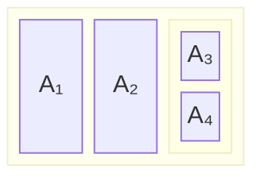
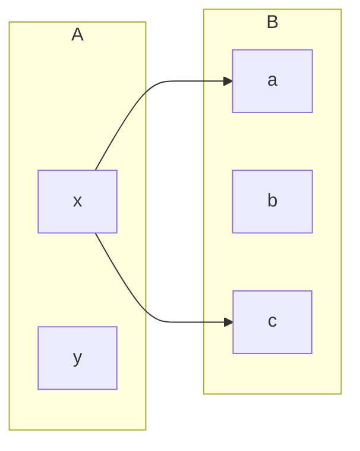
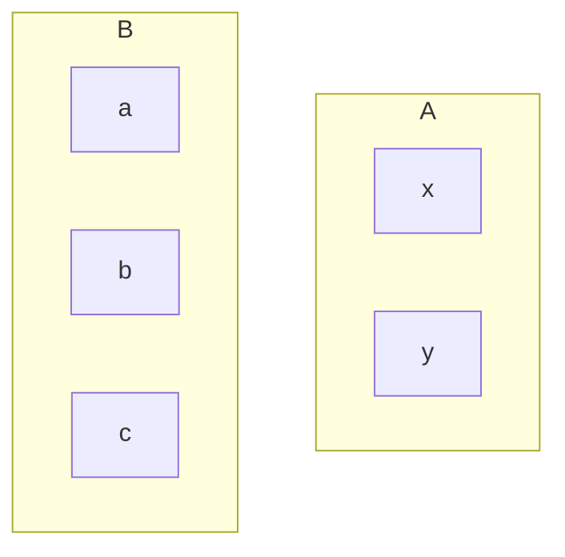
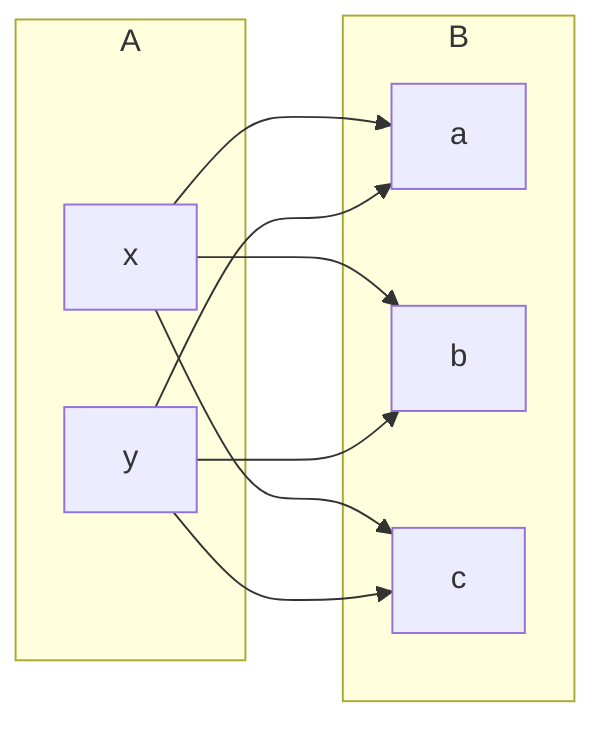
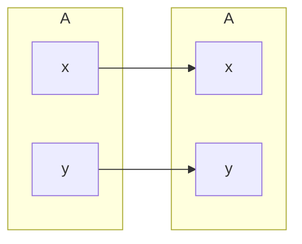
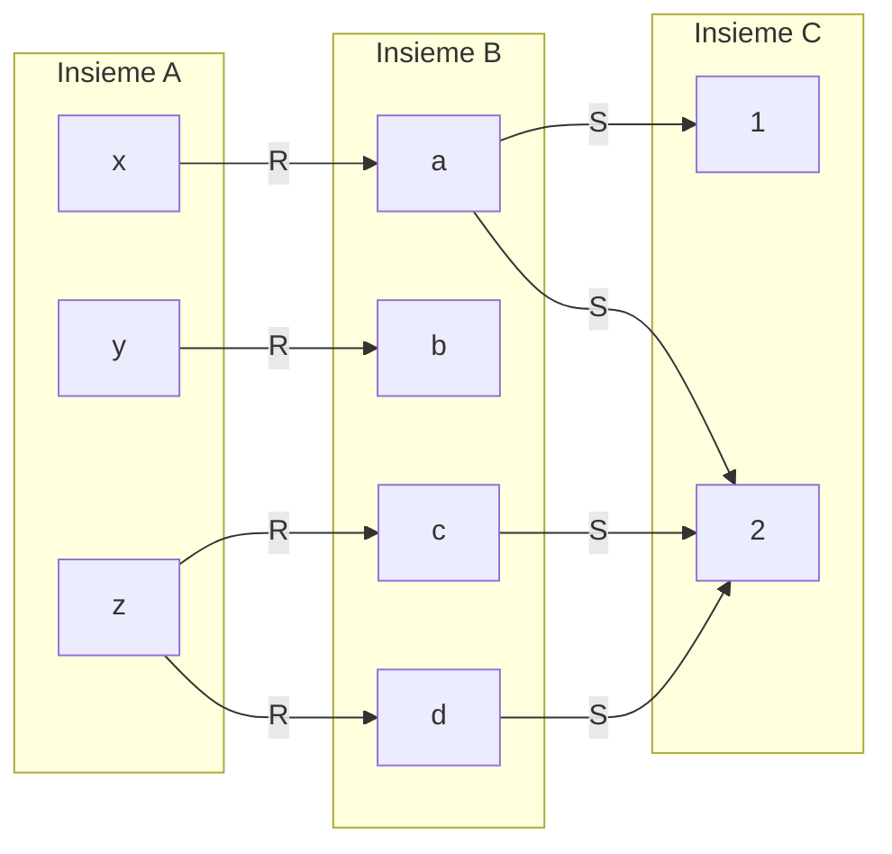
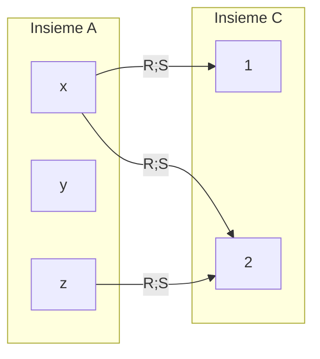

# Famiglie di insiemi

Una famiglia di insiemi $F$ indicizzata da $I$ e' una collezione di insiemi $A_i$, in cui ogni insieme è contrassegnato da un *indice* $i$ appartenente a un insieme di indici $I$.  

$$F = \{A_i \mid i \in I\} = \{A_i\}_{i \in I}$$

L'unione $\bigcup F$ e' l'insieme di tutti gli elementi presenti in **almeno un** insieme della famiglia:
  

$$\bigcup F = \bigcup_{i \in I} A_i$$

L'intersezione $\bigcap F$ e' l'insieme degli elementi presenti contemporaneamente in **tutti** gli insiemi della famiglia:
  

$$\bigcap F = \bigcap_{i \in I} A_i$$

### Esempio  

* Studenti del primo anno: $S1 = \{\text{Anna}, \text{Bob}\}$

* Insieme dei corsi: $C = \{\text{FDI}, \text{PA}\}$

* Insieme dei mesi: $M = \{\text{gennaio}, \text{febbraio}\}$

*(Supponiamo che Anna segua FDI e PA e sia nata a gennaio, mentre Bob segue solo FDI ed è nato a febbraio).*

### Caso A: Famiglia indicizzata per corso ($\mathcal{F} = \{S1_c \mid c \in C\}$)

* **Insiemi della famiglia:**

  * $S1_{\text{FDI}} = \{\text{Anna}, \text{Bob}\}$

  * $S1_{\text{PA}} = \{\text{Anna}\}$

  * Famiglia completa: $\mathcal{F} = \{S1_{\text{FDI}}, S1_{\text{PA}}\}$

* **Operazioni:**

  * $\bigcup \mathcal{F}$ **(Unione):** $\{\text{Anna}, \text{Bob}\}$ $\rightarrow$ studenti che seguono **almeno un** corso.

  * $\bigcap \mathcal{F}$ **(Intersezione):** $\{\text{Anna}\}$ $\rightarrow$ studenti che seguono **tutti** i corsi.

### Caso B: Famiglia indicizzata per mese di nascita ($\mathcal{H} = \{S1_m \mid m \in M\}$)

* **Insiemi della famiglia:**

  * $S1_{\text{gennaio}} = \{\text{Anna}\}$

  * $S1_{\text{febbraio}} = \{\text{Bob}\}$

  * Famiglia completa: $\mathcal{H} = \{S1_{\text{gennaio}}, S1_{\text{febbraio}}\}$

* **Operazioni:**

  * $\bigcup \mathcal{H}$ **(Unione):** $\{\text{Anna}, \text{Bob}\} = S1$ $\rightarrow$ unendo tutti i mesi si ricostruisce l'intera classe.

  * $\bigcap \mathcal{H}$ **(Intersezione):** $\emptyset$ (insieme vuoto) $\rightarrow$ è impossibile essere nati in più mesi contemporaneamente.

# Partizioni

Una **partizione** su un insieme $A$ è una famiglia $\boldsymbol{P} = \{A_i\}_{i \in I}$ di **sottoinsiemi** di $A$ che soddisfa le seguenti condizioni:

1. ogni insieme $A_i$ è diverso da $\emptyset$ *(insiemi non vuoti)*
2. l'unione della famiglia e' uguale ad $A$ ovvero $\bigcup \boldsymbol{P} = \bigcup_{i \in I} A_i = A$ *(copertura di $A$)*
3. dati due indici qualunque $i$ e $j$ con $i \neq j$ si ha $A_i \cap A_j = \emptyset$ *(insiemi disgiunti)*

Esempio:  

$A = \{1, 2, 3, 4, 5, 6\}$

$$A_1 = \{1, 3, 5\} \quad \text{(numeri dispari)}$$  
$$A_2 = \{2, 4, 6\} \quad \text{(numeri pari)}$$  

La famiglia $\boldsymbol{P} = \{A_1, A_2\} = \{\{1, 3, 5\}, \{2, 4, 6\}\}$ e' una partizione di $A$ poiche' rispetta le 3 proprieta'. 

$A_1 \neq \emptyset \land A_2 \neq \emptyset$  
$A_1 \cup A_2 = \{1, 3, 5\} \cup \{2, 4, 6\} = \{1, 2, 3, 4, 5, 6\} = A$  
$A_1 \cap A_2 = \emptyset$

# Relazioni   

Una **relazione $R$ tra $A$ e $B$** e' un sottoinsieme di $A \times B$ (il prodotto cartesiano).
$$A \times B = \{(a, b) \mid a \in A \land b \in B\}$$

* $R \subseteq A \times B$ (per definizione)
* $R \in Rel(A, B)$, dove $Rel(A, B)$ indica l'insieme di tutte le relazioni tra $A$ e $B$.
* $R: A \leftrightarrow B$ (simile alla tipica notazione per le funzioni)

### Esempio  

Per $R \in Rel(A, B)$ chiamiamo:
* $A$: "insieme di partenza"
* $B$: "insieme di arrivo"

Siano $A = \{x, y\}$ e $B = \{a, b, c\}$. Esempi di relazioni tra $A$ e $B$:
* $R = \{(x, a), (x, c)\} \subseteq A \times B$
* $\varnothing \subseteq A \times B$ è la **relazione vuota**, $\varnothing \in Rel(A, B)$
* $A \times B = \{(x, a), (x, b), (x, c), (y, a), (y, b), (y, c)\}$ e' la **relazione completa**

## Rappresentazione grafica di relazioni

Siano $A = \{x, y\}$ e $B = \{a, b, c\}$

$R = \{(x, a), (x, c)\}$ 

$\emptyset: A \leftrightarrow B$

$A \times B \in Rel(A, B)$

# Relazioni su un insieme

Se insieme di partenza e insieme di arrivo coincidono, allora chiamiamo le relazioni in $Rel(A, A)$ **relazioni su A**, ad esempio:  

$Succ = \{ (x, y) \in \mathbb{N} \times \mathbb{N} \mid y = x + 1 \}$  

Allora $Succ$ e' una relazione su $\mathbb{N}$ e $Succ \in Rel(\mathbb{N}, \mathbb{N})$

## Relazione identita'  

Dato un insieme $A$, la relazione identita' su $A$ e' definita come:  

$Id_a =\{(x, x) | x \in A\}$  

## Relazioni: prodotto cartesiano  

A volte l'insieme di partenza/arrivo puo' essere un prodotto cartesiano.  

$Plus = \{((x, y), z)\quad|\quad z=x+y\} : \mathbb{N}\times\mathbb{N} \leftrightarrow \mathbb{N}$  

$Plus = \{((0, 0), 0), ((1, 0), 1), ...\}$

# Operazioni insiemistiche su relazioni

Date due relazioni $R,S \in Rel(A, B)$, essendo insiemi, valgono le stesse leggi degli insiemi ma prendendo $A\times B$ come universo:  

* $R \cup S \subseteq A\times B$ e' detta **unione** di $R$ e $S$
* $R \cap S \subseteq A\times B$ e' detta **intersezione** di $R$ e $S$
* $R \setminus S \subseteq A\times B$ e' detta **differenza** di $R$ e $S$
* $\overline{R} = (A\times B\setminus R) \subseteq A\times B$ e' detta **complemento** di $R$

# Composizione di relazioni

> **Esempi:** nonna, sorella, bisnonna, nipote, ...

Siano $R,S$ due relazioni $R: A \leftrightarrow B$ e $S: B \leftrightarrow C$. La **composizione** di $R$ con $S$ e' la relazione $R; S: A \leftrightarrow C$:  
s
$$R; S = \{(x, z) \in A \times C \mid \text{esiste almeno un } y \in B \text{ tale che } (x, y) \in R \text{ e } (y, z) \in S\}$$

### Esempio

Dati... 

$A = \{x, y, z\}$  
$B = \{a, b, c, d\}$  
$C = \{1, 2\}$  

...e le relazioni...  

$R = \{(x, a), (y, b), (z, c), (z, d)\}: A \leftrightarrow B$  
$S = \{(a, 1), (a, 2), (c, 2), (d, 2)\}: B \leftrightarrow C$  

...la composizione $R;S$ e'...  

$R; S = \{(x, 1), (x, 2), (z, 2)\}: A \leftrightarrow C$  

# Quantificatori

Per semplificare e rendere rigorosi gli enunciati introduciamo i **quantificatori**:  

* **esistenziale** $\ \exists x\ .\ P$ che si legge *"esiste un $x$ tale che $P$ vale"*
* **universale** $\ \forall x\ .\ P$ che si legge *"per ogni $x$ vale $P$"*

Adesso invece di:  

$$R; S = \{(x, z) \in A \times C \mid \text{esiste almeno un } y \in B \text{ tale che } (x, y) \in R \text{ e } (y, z) \in S\}$$

possiamo scrivere:  

$$R; S = \{(x, z) \in A \times C \mid (\exists y \in B\ .\ (x, y) \in R \land (y, z) \in S)\}$$

## Esempi di composizione

Dati...  

$Madre = \{(x, y) \in EU \times EU \mid x \text{ è madre di } y\}$  
$Padre = \{(x, y) \in EU \times EU \mid x \text{ è padre di } y\}$  
$Genitore = Madre \cup Padre$  

... dove $EU$ e' l'insieme degli esseri umani, se volessimo la composizione $\text{Nonno}$ dovremmo trovare tutti i padri i cui figli sono genitori...   

$$\text{Nonno} = Padre ; Genitore$$  

In forma estesa...  

$$\text{Nonno} = \{(x, z) \mid (\exists y \in EU . (x, y) \in Padre \land (y, z) \in Genitore)\}$$

# Leggi per composizione

Per gli insiemi $A, B, C, D$ e relazioni $R: A \leftrightarrow B$, $S: B \leftrightarrow C$ e $T: C \leftrightarrow D$ valgono le seguenti leggi:  
  * **associativita'** - $R; (S; T) = (R; S); T$
  * **unita'** - $Id_A; R = R = R; Id_B$
  * **assorbimento** - $R; \varnothing_{B,C} = \varnothing_{A,C} = \varnothing_{A,B} ; S$

E' vero che per tutti gli insiemi $A, B, C$ e per ogni relazione $R \in Rel(A, B)$ vale $R; B \times C = A \times C$ ? Dare una dimostrazione o presentare un controesempio.

> No, nel caso in cui B sia l'unico insieme vuoto si ha che $R; B\times C = \varnothing$ mentre $A\times C \ne \varnothing$  
