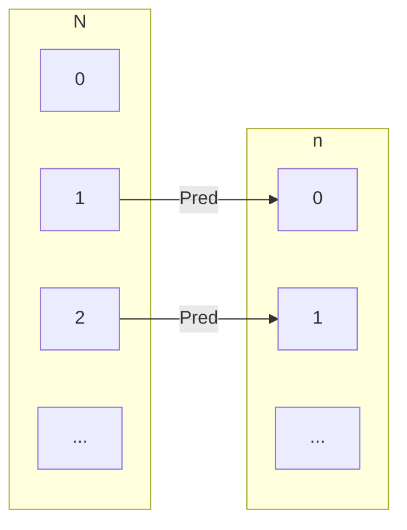

# Relazione Opposta

Dato $R: A \leftrightarrow B$, la **relazione opposta** $R^{op}: B \leftrightarrow A$ inverte l'ordine di ogni coppia:

$$R^{op} = \{(y, x) \in B \times A \mid (x, y) \in R\}$$

### Esempi

* **Genitore**: $\text{Genitore}^{op} = \text{Figlio/a}$
* **Successore**: $\text{Succ}^{op} = \text{Pred}$ (Predecessore, dove $y = x - 1$)

$Succ^{op} = \{(y,x) \in \mathbb{N}\times\mathbb{N}\ |\ (x,y)\in Succ\}$  

# Relazione Opposta e Composizione

$A = \{x, y, z\}$  
$B = \{a, b, c, d\}$  
$C = \{1, 2\}$  

$R = \{(x,a), (y,b), (z,c), (z,d)\}: A \leftrightarrow B$  
$S = \{(a,1), (a,2), (c,2), (d,2)\}: B \leftrightarrow C$  

$R; S = \{(x,1), (x,2), (z,2)\}: A \leftrightarrow C$  

$R^{op} = \{(a,x), (b,y), (c,z), (d,z)\}: B \leftrightarrow A$  
$S^{op} = \{(1,a), (2,a), (2,c), (2,d)\}: C \leftrightarrow B$  

L'opposto della composizione e' quindi...  

$(R; S)^{op} = S^{op}; R^{op} = \{(1,x), (2,x), (2,z)\}$  

## Leggi di Distributivita'

| Nome | Formula |
| :--- | :--- |
| **Distributività $;$ su $\cup$ (sinistra)** | $R ; (S \cup T) = (R ; S) \cup (R ; T)$ |
| **Distributività $;$ su $\cup$ (destra)** | $(S \cup T) ; U = (S ; U) \cup (T ; U)$ |
| **Distributività $^{op}$ su $;$** | $(R ; S)^{op} = S^{op} ; R^{op}$ |
| **Distributività $^{op}$ su $\cup$** | $(S \cup T)^{op} = S^{op} \cup T^{op}$ |
| **Distributività $^{op}$ su $\cap$** | $(S \cap T)^{op} = S^{op} \cap T^{op}$ |
| **Distributività $^{op}$ su complementare** | $(\overline{R})^{op} = \overline{R^{op}}$ |

## Distributivita' su `U` sinistra  

Per tutte le relazioni $R: A \leftrightarrow B$, $S: B \leftrightarrow C$ e $T: B \leftrightarrow C$ vale:

$$R ; (S \cup T) = (R ; S) \cup (R ; T) : A \leftrightarrow C$$  

#### Dimostrazione:

$$(a, c) \in R ; (S \cup T) \equiv \{\text{def di } ;\}$$  

$$(\exists b \in B . \, (a, b) \in R \land (b, c) \in S \cup T) \equiv \{\text{def di } \cup\}$$  

$$(\exists b \in B . \, (a, b) \in R \land ((b, c) \in S \lor (b, c) \in T))\equiv \{\text{distr. } \land \text{ su } \lor, \text{ distr. } \exists \text{ su } \lor\}$$  

$$(\exists b \in B . \, (a, b) \in R \land (b, c) \in S) \lor (\exists b \in B . \, (a, b) \in R \land (b, c) \in T) \equiv \{\text{def di } ;\}$$  

$$((a, c) \in R ; S) \lor ((a, c) \in R ; T) \equiv \{\text{def di } \cup\}$$  

$$(a, c) \in (R ; S) \cup (R ; T)$$  
