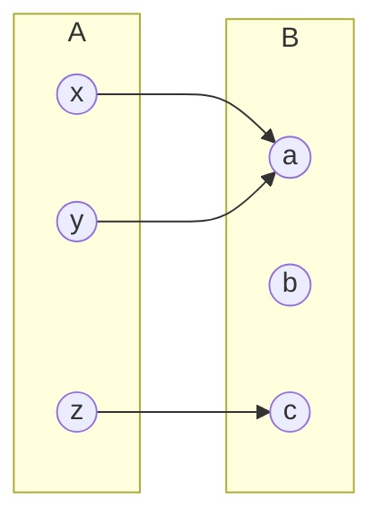
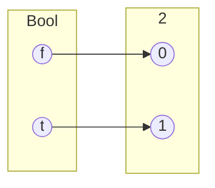
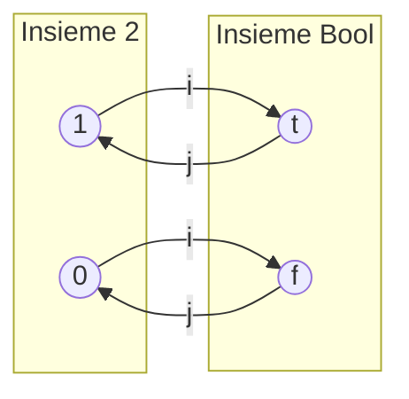
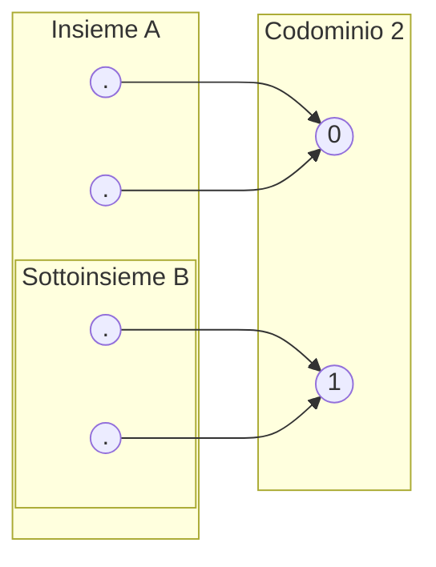

### Definizione di totalita'
Una relazione $R : A \leftrightarrow B$ si dice **totale** se ogni elemento del dominio $A$ e' in relazione con **almeno** un elemento di $B$:

$$\forall a \in A.\ (\exists b \in B.\ (a, b) \in R)$$

## Dal teorema di caratterizzazione alla definizione di totalita'
Una relazione $R : A \leftrightarrow B$ e' totale se e solo se l'identita' $Id_A$ e' contenuta nella composizione $R;R^{op}$:

$$Id_A \subseteq R;R^{op}$$

*Dimostrazione sintetica:*
$$\forall a \in A.\ (a, a) \in R;R^{op} \iff \forall a \in A.\ (\exists b \in B.\ (a, b) \in R \land (b, a) \in R^{op})$$
Poiché $(b, a) \in R^{op} \iff (a, b) \in R$, per la legge di idempotenza della congiunzione $P \land P \equiv P$ possiamo rimuovere la condizione ottenendo:
$$\forall a \in A.\ (\exists b \in B.\ (a, b) \in R)$$

---

## Chiusura per composizione  

Se $R$ e $S$ godono di una proprietà $P$ (es. totalità), allora anche $R;S$ ne gode.  

>Se $R : A \leftrightarrow B$ e $S : B \leftrightarrow C$ sono totali, allora anche la loro composizione $R;S$ e' totale.  

> Se invece $R;S$ e' totale allora possiamo solo dire che $R$ e' totale! 

## Dimostrazione: Chiusura della Totalità rispetto alla Composizione

>Se $R$ e $S C$ sono totali, allora anche la loro composizione $R;S$ e' totale.  

1. $R$ totale $\implies Id_A \subseteq R;R^{op}$
2. $S$ totale $\implies Id_B \subseteq S;S^{op}$
3. allora $R;S$ e' totale $\implies Id_A \subseteq (R;S);(R;S)^{op}$
---

$Id_A \subseteq R;R^{op}$ *(per ipotesi 1 su $R$)*

Per la legge di unita' $R = R;Id_B$ per cui...  

$Id_A \subseteq R;Id_B;R^{op}$

Per l'ipotesi numero 2 possiamo sostituire $Id_B$ in quanto e' contenuto in $S;S^{op}$...  

$Id_A \subseteq R;(S;S^{op});R^{op}$  

Per l'associativita'...  

$Id_A \subseteq (R;S);(S^{op};R^{op})$  

Per la distributivita' di $^{op}$ sulla composizione...  

$Id_A \subseteq (R;S);(S;R)^{op}$  

## Funzioni

Una relazione $R : A \leftrightarrow B$ e' una **funzione** (indicata con $f : A \to B$) se è **totale** e **univalente** ovvero: 

>Se per ogni $a \in A$ esiste *esattamente un* $b \in B$ tale che $(a, b) \in R$.

$$\text{Fun}(A, B) = \{ f : A \to B \mid f \text{ e' una funzione} \}$$

### Esempi
- $Id_A : A \to A$ e' sempre una funzione.
- Il prodotto cartesiano $A \times B : A \leftrightarrow B$ in generale **non** e' una funzione (non e' univalente), rispetta la definizione di funzione solo quando $A$ e $B$ sono singoletti.

---

### Rappresentazione di Funzioni

Una funzione si definisce specificando $f(a) = b$ per tutti gli elementi del dominio.

Ad esempio la funzione Successore $\text{Succ} : \mathbb{N} \to \mathbb{N}$ e' definita come $\text{Succ}(x) = x + 1$

#### Analisi vs Informatica
*   *Analisi:* Solitamente $f : \mathbb{R} \to \mathbb{R}$.
*   *Informatica:* Modello Input $\to \boxed{f} \to$ Output.
*   *Connettivi Logici:* $\text{AND} : \mathbb{B} \times \mathbb{B} \to \mathbb{B}$
*   *Predicati/Insiemi:* Esempio dei numeri pari $\mathbb{N}^p = \{n \in \mathbb{N} \mid n \bmod 2 = 0\}$.

### Composizione di Funzioni

Dati $f : A \to B$ e $g : B \to C$, la composizione $f;g : A \to C$ (spesso indicata con $g \circ f$) e' anch'essa una funzione:

$$(f;g)(a) = g(f(a)) = (g \circ f)(a)$$

## Biezioni
Una relazione $R : A \leftrightarrow B$ e' una **biezione** se e' sia **totale, univalente, suriettiva e iniettiva**, ovvero:

>per tutti gli $a \in A$ esiste esattamente un $b \in B$ tale che $a,b \in R$ e
per tutti i $b \in B$ esiste esattamente un $a \in A$ tale che $a,b \in R$

**Esempio:** $\mathbb{B} = \{t, f\}$ e $2 = \{0, 1\}$.
La relazione $R = \{(t, 1), (f, 0)\}$ e' una biezione tra $\mathbb{B}$ e $2$.

### Risultati di Chiusura

Dati $A,B,C$ e le biiezioni $i:A\to B, \quad j: B\to C$ si ha che:  

1. $Id_A : A \to A$ e' una biezione.
2. Se $i : A \to B$ e $j : B \to C$ sono biezioni, allora la loro composizione $i;j : A \to C$ e' una biezione.
3. Se $i$ e' una biezione, anche la relazione opposta $i^{op}$ e' una biezione.

## Teorema di Caratterizzazione per Biezioni
Sia $R : A \leftrightarrow B$. $R$ e' una biezione se e solo se:

$$Id_A = R;R^{op} \quad \text{e} \quad Id_B = R^{op};R$$

#### Inversa e Invertibilità
Una relazione $S : B \leftrightarrow A$ e' l'**inversa** di $R : A \leftrightarrow B$ se:

$$Id_A = R;S \quad \text{e} \quad Id_B = S;R$$

*Una relazione e' invertibile se e solo se ammette un'inversa. Allora per dimostrare la biettivita' di $R$ basta dimostrare che $R;S = Id_A$*

# Insiemi in Biezione ($\cong$)

Due insiemi $A$ e $B$ sono in biezione (isomorfi), indicato con $A \cong B$, se esiste una biezione tra di essi.

Per dimostrare che $A \cong B$:
1. Definisci $i : A \to B$
2. Definisci $j : B \to A$
3. Dimostra che $i;j = Id_A$
4. Dimostra che $j;i = Id_B$

---

### Esempio: $2 \cong \mathbb{B}$

Dati: 

$\mathbb{B} = \{t, f\}$  
$2 = \{0, 1\}$

Definiamo $i : 2 \to \mathbb{B}$ e $j : \mathbb{B} \to 2$:
- $i(0) = f$, $i(1) = t$
- $j(t) = 1$, $j(f) = 0$

Poiche' $i;j = Id_2$ e $j;i = Id_\mathbb{B}$, concludiamo che $2 \cong \mathbb{B}$.

---

### Risultato Notevole: $\mathcal{P}(A) \cong \text{Fun}(A, 2)$
L'insieme delle parti di $A$, $\mathcal{P}(A)$, è in biezione con l'insieme delle funzioni da $A$ a $2 = \{0, 1\}$ (funzioni    caratteristiche):

$$\mathcal{P}(A) \cong \text{Fun}(A, 2)$$

---

### Proprieta' della Relazione di Equipotenza ($\cong$)
La relazione $\cong$ e' una relazione di equivalenza:

1. **Riflessiva:** $A \cong A$
2. **Simmetrica:** $A \cong B \implies B \cong A$
3. **Transitiva:** $A \cong B \land B \cong C \implies A \cong C$