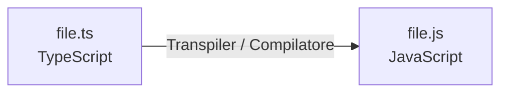

## JavaScript & TypeScript

- **JavaScript (JS)**: Linguaggio interpretato, flessibile e con poche restrizioni (*weakly typed* / a tipizzazione debole).
- **TypeScript (TS)**: Estensione (superset) di JavaScript che introduce una tipizzazione forte (*strongly typed*).

### Processo di Traspilazione
Un **transpiler** (o compilatore TS) traduce il codice TypeScript in JavaScript eseguibile dal browser o da Node.js.



## Concetti Base di Programmazione

- **Programma / I/O**:
  - **Input**: Parametri o dati forniti dall'utente (es. `prompt()`).
  - **Output**: Risultati mostrati a video o salvati (es. `console.log()`).
- **Espressioni vs Comandi**:
  - **Espressione**: Produce sempre un valore finale (es. `2 + 5`).
  - **Comando (Statement)**: Esegue un'azione e non restituisce un valore finale espresso (es. un'assegnazione `b = 5`, `console.log()`).

## Tipi di Dato e Variabili

### Tipi Primitivi
1. **Number**: 
   - Interi: `2`, `-5`, `0`
   - Reali (floating point): `2.5`
   - Valori speciali: `NaN` (*Not a Number*), `Infinity`, `-Infinity`
2. **Boolean**: `true` / `false`
3. **String**: 
   - Delimitati da `""`, `''` o backtick `` ` ``.
   - **Template Literals**: Usano i backtick per l'interpolazione:
     ```js
     `2 + 5 = ${2 + 5}` // Risultato: "2 + 5 = 7"
     ```
   - **Operatori**: `+` per la concatenazione e operatori di confronto in ordine *lessicografico*.
4. **BigInt**: Usato per interi arbitrariamente grandi.
   - Sintassi: aggiunta della lettera `n` finale (es. `let bigNumber = 123456...918n`).
5. **Undefined vs Null**:
   - `undefined`: Valore non definito. E' un tipo per variabili a cui non e' ancora stato assegnato un valore.
   - `null`: Assenza intenzionale di un valore.

### Tipi Non Primitivi
- **Oggetti** (dizionari), **Array**, **Funzioni**.
- *Nota*: Il comando `typeof` applicato a questi tipi restituisce sempre `"object"`.

### Variabili e Binding
- Dichiarazioni tramite: `let`, `var`, `const`.
- Differenza tra dichiarazione ed assegnamento:
  ```ts
  let a: number; // Dichiarazione (con tipo explicit in TS)
  a = 5;         // Assegnamento
  ```

## Conversione di Tipo (Casting) e Inferenza di Tipo

### Type Casting (Conversione Esplicita)
Il cast converte un tipo in un altro e restituisce sempre un valore (che puo' essere `NaN` se la conversione fallisce).

| Espressione | Risultato |
| :--- | :--- |
| `String(4)` | `"4"` |
| `Number("3.502")` | `3.502` |
| `Number("abc")` | `NaN` |
| `Boolean("4")` | `true` |
| `Boolean("")` | `false` |

### Inferenza di Tipo
TypeScript deduce automaticamente il tipo in base al valore assegnato:
```ts
let x = 3; // TS inferisce x: number
```
*Nota*: Non occorre specificare sempre il tipo in modo esplicito; l'inferenza e' spesso ovvia, ma in alcuni casi non lo e' percio' e' sempre bene esplicitarlo.

## Uguaglianza e Coercizione di Tipo

- `==` e `!=`: Esegue la **Type Coercion** (conversione automatica implicita dei tipi prima del confronto).
- `===` e `!==` **(best practice)**: **Uguaglianza e disuguaglianza stretta**.
  - Confronta sia il **valore** che il **tipo** senza fare conversioni automatiche.
  - Esempio:
    ```js
    null === undefined // false (tipi diversi)
    null == undefined  // true  (coercizione di tipo)
    ```