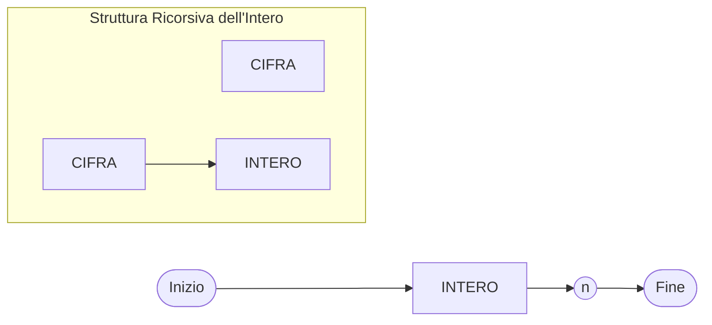
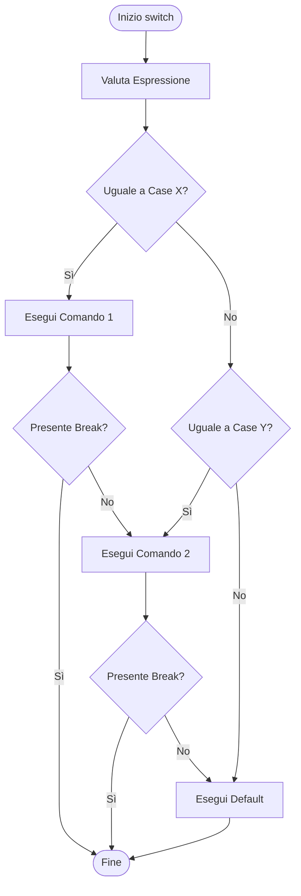

## Grammatica per i Letterali (Backus-Naur Form)

Per definire la sintassi dei letterali (es. `BigInt`) si usano i **diagrammi di sintassi**:
* **Simboli Non-Terminali**: rappresentati con rettangoli (es. `INTERO`, `CIFRA`).
* **Simboli Terminali**: rappresentati con forme tonde/ovali (es. `n`).

### Diagramma di Sintassi per BigInt



---

## Dichiarazione, Assegnamento e Controllo di Flusso

### Binding e Assegnamento
* **Dichiarazione**: associa un identificatore a una variabile (*Binding*).
* **Assegnamento**: memorizza un valore all'interno di una locazione di memoria.

```typescript
let x: number = 4; // Dichiarazione con binding
x = 6;            // Assegnamento
```

### Controllo di Flusso: `if ... else`

Consente l'esecuzione condizionale di blocchi di codice:

```typescript
if (x > 0) {
  // Ramo A
} else {
  // Ramo B
}
```

### Operatore Logico Ternario (`? :`)
A differenza della dichiarazione `if`, l'operatore ternario **e' un'espressione** (restituisce un valore) e puo' essere usato all'interno di valutazioni dirette:

```typescript
// Sintassi: condizione ? valore_se_vero : valore_se_falso
let s: string = x > 0 ? "p" : "n";
```

---

## Valori Falsy e Truthy

In JavaScript/TypeScript, ogni valore puo' essere valutato in un contesto booleano.

### Gli 8 Valori Falsy
Esistono esattamente **8 valori** che vengono valutati come `false`:
1. `false`
2. `0`
3. `-0`
4. `0n` (BigInt zero)
5. `""` (stringa vuota)
6. `null`
7. `undefined`
8. `NaN`

> **Tutti gli altri valori sono Truthy** (compresi gli oggetti vuoti `{}` e gli array vuoti `[]`).

---

## Comando Condizionale `switch`

Lo statement `switch` valuta un'espressione rispetto a piu' casi (`case`).

```typescript
switch (espressione) {
  case x:
    // Comando 1
    break; // Il break evita il fall-through
  case y:
    // Comando 2
    break;
  default:
    // Eseguito se nessun case corrisponde
}
```

### Note Importanti su `switch`:
* **`break`**: e' opzionale. Senza `break`, la risposta continua ad eseguire i comandi dei `case` successivi senza controllare le condizioni di validita' (*fall-through*).
* **`default`**: opzionale, gestisce i casi non specificati.
* **Tipo `any` ed errori TS**: se usiamo il tipo `any` (es. `let x: any`), `switch(x)` accetterà di confrontare tipi eterogenei (es. `case 1`, `case "1"`). Tuttavia, **TypeScript solleva un'eccezione se individua tipi non confrontabili**.

