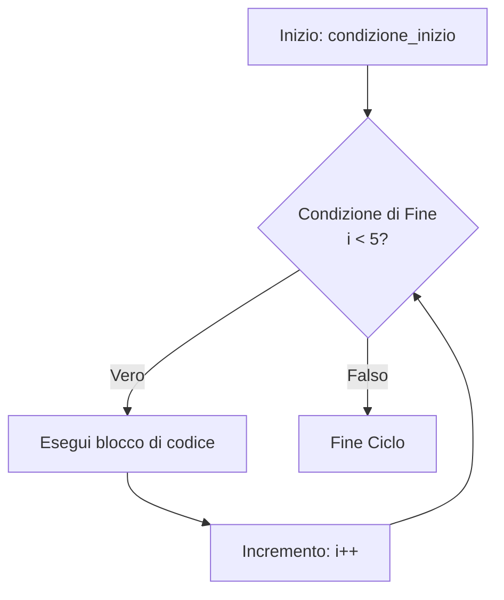
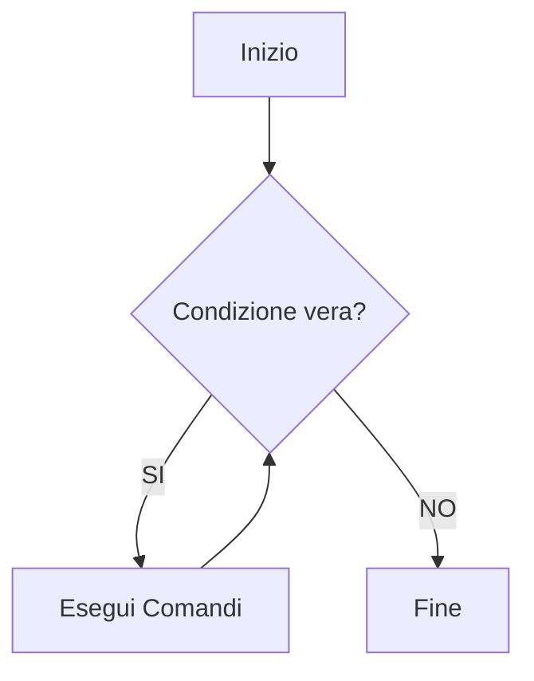
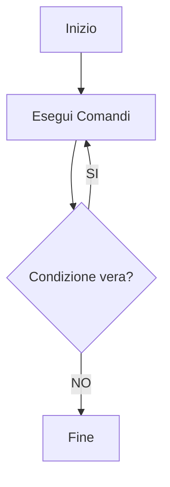

## Il Ciclo `for`

Il ciclo `for` si utilizza principalmente quando **si conosce a priori il numero di iterazioni** da eseguire.

### Sintassi
```typescript
for (condizione_inizio; condizione_fine; incremento) {
    // Istruzioni da eseguire
}
```

### Esempio Pratico
```typescript
for (let i: number = 0; i < 5; i++) {
    console.log(i);
}
// Output: 0, 1, 2, 3, 4
```

> **Nota:** L'incremento (`i++`) viene eseguito **implicitamente al termine di ogni iterazione** del ciclo, prima della successiva verifica della condizione di fine.

### Flusso di Esecuzione (`for`)


---

## Iterazione su Array: `for...of` vs `for...in`

Consideriamo un array di elementi $a = [a_0, a_1, a_2, a_3]$ dove la dimensione e' $N = 4$:

```typescript
let a: number[] = [3, 5, 1, 5];
```

Esistono due sintassi dedicate per scorrere gli array:

### `for...of` (Valori)
Scorre ed estrae **i singoli elementi** (valori) contenuti nell'array.
```typescript
for (let i of a) {
    console.log(i);
}
// Output: 3, 5, 1, 5
```

### `for...in` (Indici)
Scorre ed estrae **gli indici** (le posizioni $0 \le i < N$) delle chiavi dell'array.
```typescript
for (let i in a) {
    console.log(i);
}
// Output: 0, 1, 2, 3
```

| Sintassi | Scopo principale | Output sull'array `[3, 5, 1, 5]` |
| :--- | :--- | :--- |
| `for (let i of a)` | Stampa gli **elementi** | `3, 5, 1, 5` |
| `for (let i in a)` | Stampa gli **indici** | `0, 1, 2, 3` |

---

## Cicli `while` e `do...while`

I cicli basati su condizione si dividono in due categorie principali a seconda di **quando** viene effettuato il controllo della condizione.

### Ciclo `while` (Pre-condizionale)
Controlla la condizione **prima** di eseguire il blocco di codice. Se la condizione e' falsa fin dall'inizio, il blocco non viene mai eseguito.

```typescript
while (condizione_di_esecuzione) {
    // Comandi
}
```



### Ciclo `do...while` (Post-condizionale)
Esegue **prima** il blocco di codice e **dopo** controlla la condizione. Il blocco viene quindi eseguito **almeno una volta**, indipendentemente dallo stato della condizione.

```typescript
do {
    // Comandi
} while (condizione);
```



---

## Controllo del Flusso: `break` e `continue`

Per alterare il normale flusso d'esecuzione all'interno dei cicli si usano due istruzioni chiave:

* **`break`**: Interrompe immediatamente l'esecuzione del ciclo ed **esce** definitivamente dal blocco iterativo.
* **`continue`**: **Salta** l'iterazione corrente e passa subito al controllo della condizione dell'iterazione successiva.

---

## Osservazione Fondamentale

> **OSS:** Ogni ciclo `for` puo' essere riscritto in forma equivalente usando un ciclo `while`. Tuttavia, **non e' sempre vero o naturale il contrario**, poiche' il `while` gestisce in modo piu' naturale cicli con un numero indeterminato o indefinito di iterazioni.

### Equivalenza Logica:
```typescript
// Ciclo FOR
for (let i = 0; i < N; i++) {
    // codice
}

// Equivalente in WHILE
let i = 0;
while (i < N) {
    // codice
    i++;
}
```

---

## Misura del Tempo di Esecuzione

Per misurare le prestazioni di un algoritmo o l'intervallo necessario a completare un'operazione si utilizza la funzione `Date.now()`.

### Il Concetto di Epoch Time
`Date.now()` restituisce il tempo trascorso sotto forma di millisecondi ($ms$) a partire dal **Unix Epoch**:
$$\text{Epoch} = 1^\text{o} \text{ Gennaio } 1970, \text{ 00:00:00 UTC}$$

### Formula del Tempo di Esecuzione
Detti $t_{\text{start}}$ il timestamp iniziale e $t_{\text{end}}$ il timestamp finale, la durata totale dell'esecuzione $\Delta t$ e' data da:
$$\Delta t = t_{\text{end}} - t_{\text{start}} \quad [\text{ms}]$$

### Implementazione in Codice
```typescript
let start: number = Date.now();

// --- ESECUZIONE DEL PROGRAMMA ---

let end: number = Date.now();
console.log(`Tempo impiegato: ${end - start} ms`);
```