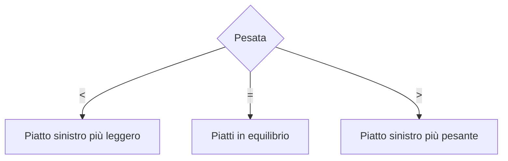
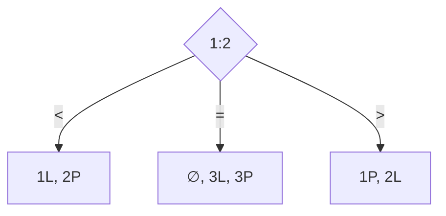
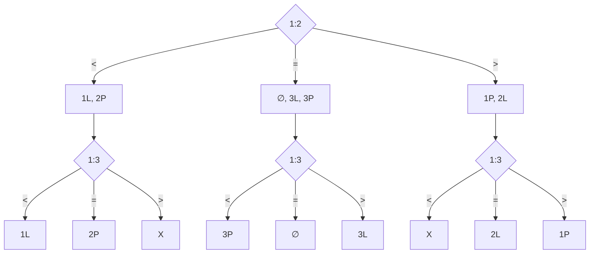
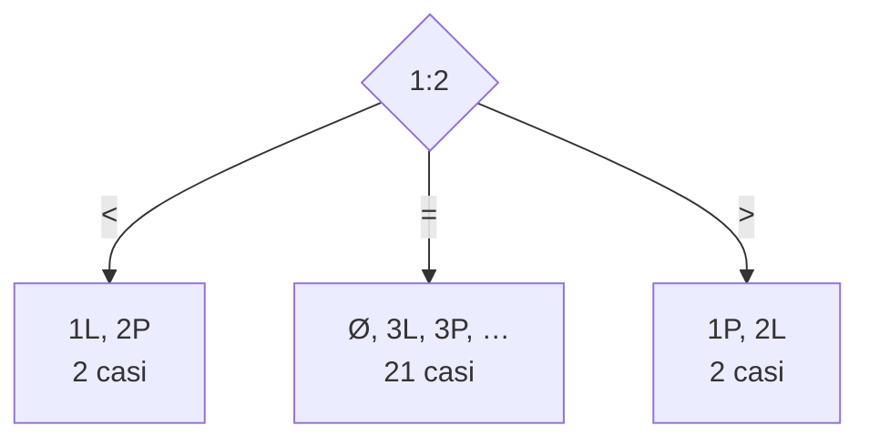
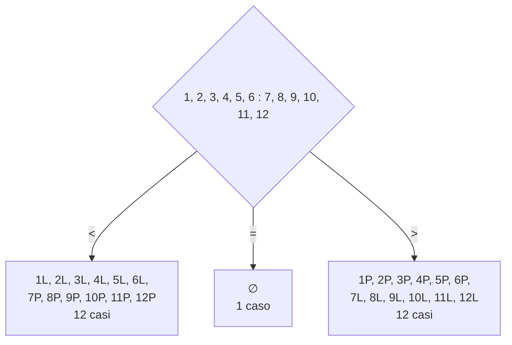
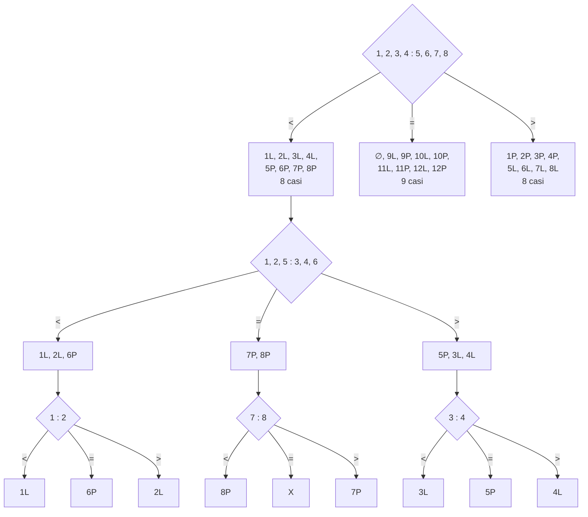

# Informatica

L'informatica è lo studio sistematico dei processi algoritmici che trasformano le informazioni.

### Algoritmo

Un **algoritmo** è una sequenza finita di passi univocamente determinati che, se eseguiti, permettono di risolvere un problema.

Due proprietà essenziali sono:

- **Finitezza:** l'algoritmo deve essere composto da un numero finito di passi.
- **Non ambiguità:** ogni passo deve essere determinato in modo univoco, senza possibilità di interpretazioni diverse.

### Programma

Un **programma** è la formulazione di un algoritmo in un linguaggio di programmazione.

### Problem solving

Il *problem solving* consiste nell'analisi e nella risoluzione di problemi, in questo contesto, problemi computazionali.

## Alberi decisionali

Un **albero decisionale** rappresenta le possibili scelte di un algoritmo e i relativi esiti. Nel caso di una pesata con una bilancia a due piatti si hanno i seguenti esiti:

- il piatto sinistro è più leggero (`<`);
- i due piatti hanno lo stesso peso (`=`);
- il piatto sinistro è più pesante (`>`).

## Problema delle 3 monete

Si introduce ora il problema delle 3 monete:

> Abbiamo 3 monete di cui una potrebbe essere falsa, se c'e' la si riconosce perche' ha un peso diverso rispetto alle altre, o piu' leggera o piu' pesante. Vogliamo allora trovare, se esiste la moneta falsa utilizzando il numero minimo di pesate.

Per tre monete, gli esiti possibili sono sette:

| Possibilità | Significato |
| --- | --- |
| `∅` | Nessuna moneta anomala |
| `1L`, `2L`, `3L` | La moneta indicata è più leggera |
| `1P`, `2P`, `3P` | La moneta indicata è più pesante |

In modo intuitivo, una pesata restringe le ipotesi: l'esito `<` o `>` indica quale piatto ha un peso minore o maggiore, mentre l'esito `=` esclude le monete presenti sui piatti dalla causa della differenza di peso.  

Dato che una pesata puo' distinguere solo 3 esiti, servono almeno 2 pesate per disntiguerne 7 in quanto 2 pesate aprono la strada a $3^2 = 9$ possibilita'.  

## Problema delle 12 monete  

Con 12 monete si hanno 24 esiti possibili `1L, 1P, 2L, 2P, ..., 12L, 12P` piu' uno `∅` nel caso in cui non ci sia alcuna moneta anomala, per un totale di 25 possibilita'.  

> Dal numero di soluzioni possiamo ricavare il numero di passi necessari alla risoluzione.

In questo caso 2 pesate non saranno sufficienti in quanto $3^2 = 9 < 25$ serviranno quindi 3 pesate $3^3 = 27 > 25$  

Ipotizzando di iniziare come nel problema delle 3 monete si realizza immediatamente che i rami dell'albero decisionale sono sbilanciati, con 21 casi nel ramo centrale per i quali occorrerebbero almeno altre 3 pesate, ma noi ne abbiamo gia' utilizzata una!  

Confrontando invece 6 monete contro 6 monete, i rami di squilibrio contengono 12 casi ciascuno.  

Anche questa volta per distinguere 12 casi avremmo bisogno di almeno 3 pesate, ma ne abbiamo gia' usata una!  

### Soluzione ottimale  

Facendo qualche altro tentativo scopriamo che per bilanciare le operazioni occorre confrontare 4 monete contro 4 monete. In questo modo i tre rami contengono rispettivamente 8, 9 e 8 casi. Questo ci garantisce la risoluzione in un massimo 3 pesate in qualunque ramo.  

> Il bilanciamento delle operazioni porta alla soluzione ottimale  

E' importante notare che nella seconda pesata vogliamo distribuire 4 delle monete risulate leggere e 2 di quelle risultate pesanti, in questo modo possiamo di nuovo bilanciare i rami in modo che ciascun esito della seconda pesata lasci al massimo 3 candidati.  
