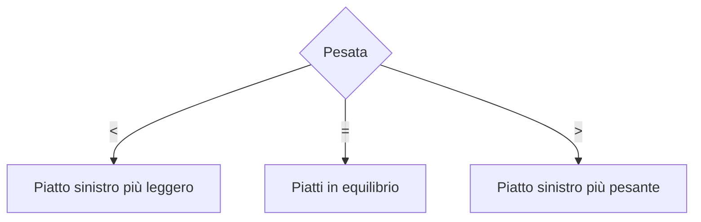
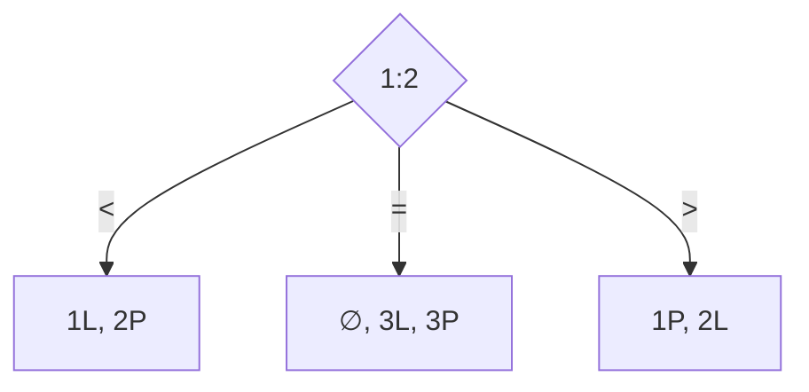
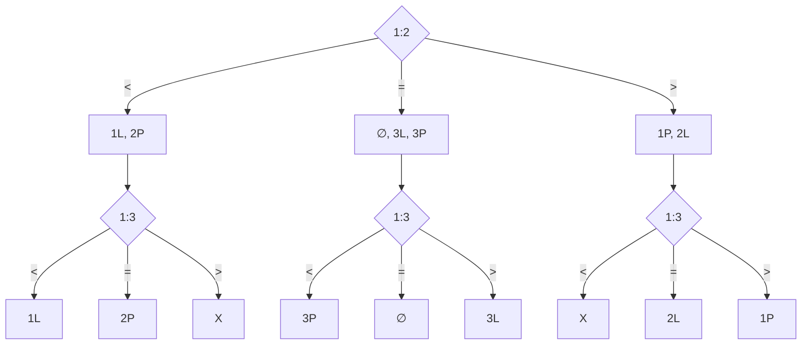

# Informatica

L'informatica è lo studio sistematico dei processi algoritmici che trasformano le informazioni.

### Algoritmo

Un **algoritmo** è una sequenza finita di passi univocamente determinati che, se eseguiti, permettono di risolvere un problema.

Due proprietà essenziali sono:

- **Finitezza:** l'algoritmo deve essere composto da un numero finito di passi.
- **Non ambiguità:** ogni passo deve essere determinato in modo univoco, senza possibilità di interpretazioni diverse.

### Programma

Un **programma** è la formulazione di un algoritmo in un linguaggio di programmazione.

### Problem solving

Il *problem solving* consiste nell'analisi e nella risoluzione di problemi, in questo contesto, problemi computazionali.

## Alberi decisionali

Un **albero decisionale** rappresenta le possibili scelte di un algoritmo e i relativi esiti. Nel caso di una pesata con una bilancia a due piatti si hanno i seguenti esiti:

- il piatto sinistro è più leggero (`<`);
- i due piatti hanno lo stesso peso (`=`);
- il piatto sinistro è più pesante (`>`).

## Problema delle 3 monete

Si introduce ora il problema delle 3 monete:

> Abbiamo 3 monete di cui una potrebbe essere falsa, se c'e' la si riconosce perche' ha un peso diverso rispetto alle altre, o piu' leggera o piu' pesante. Vogliamo allora trovare, se esiste la moneta falsa utilizzando il numero minimo di pesate.

Per tre monete, gli esiti possibili sono sette:

| Possibilità | Significato |
| --- | --- |
| `∅` | Nessuna moneta anomala |
| `1L`, `2L`, `3L` | La moneta indicata è più leggera |
| `1P`, `2P`, `3P` | La moneta indicata è più pesante |

In modo intuitivo, una pesata restringe le ipotesi: l'esito `<` o `>` indica quale piatto ha un peso minore o maggiore, mentre l'esito `=` esclude le monete presenti sui piatti dalla causa della differenza di peso.  

Dato che una pesata puo' distinguere solo 3 esiti, servono almeno 2 pesate per disntiguerne 7 in quanto 2 pesate aprono la strada a $3^2 = 9$ possibilita'.  

