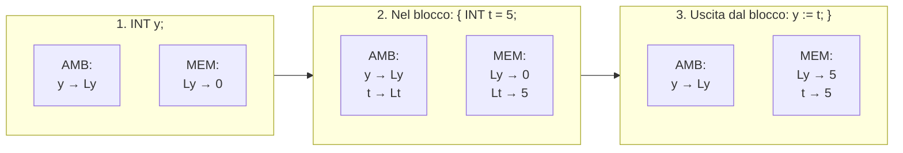

## Blocco di comandi
```c
C ::= ...
    | ...
    | { C } // blocco di comandi
    | ...

if (E) { C_1 } else { C_2 }
```

### Visibilita' delle variabili  

> Tutte le variabili dichiarate all'interno di un blocco sono visibili solo al suo interno e nei blocchi annidati se esistono.

Lo **scope** (o ambito di visibilita') definisce la porzione di programma/codice nella quale la variabile e' visibile e puo' essere utilizzata.

Ad esempio il seguente programma produrrebbe un errore.  

```c
if vincita {
    int x = 10;
} else {
    int x = 0;
}
tot := tot + x; // NON FUNZIONA!
```

**Esempio Corretto**

```c
int x;
if vincita {
    x := 10;
} else {
    x := 0;
}
tot := tot + x; // QUESTO FUNZIONA!
```

## Variabili nei blocchi  

Si consideri il codice...    

```c
int y;
{
    int t = 5;
    y := t;
}
```



*Nota: Uscendo dal blocco l'ambiente di `t` viene distrutto ma la memoria resta!*  

Per semplicita' di rappresentazione ho usato un solo ambiente, ma in pratica e' come se venisse creato un ambiente specifico per il blocco. Nella valutazione delle variabili il blocco piu' vicino ha la precedenza, se il nome di variabile non viene trovato nell'ambiente del blocco piu' vicino si passa all'ambiente superiore.  


## Shadowing  

Le variabile dichiarata all'interno di blocco con lo stesso nome di variabili esterne al blocco nascondono quelle dichiarate fuori dal blocco.  


```c
int sconto = 2;
if prezzo > 50 {
    int sconto = 10;
    prezzo := prezzo - sconto; // (10)
}
prezzo := prezzo - sconto;     // (2)
```

## Comando iterativo  

```c
while (E) { C }
```
*   **E**: guardia
*   **C**: corpo

La guardia viene controllata per determinare se il corpo deve essere eseguito. Se `E` e' vera allora si esegue `C` e si torna al controllo della guardia. Se `E` e' falsa termina. Il corpo puo' essere eseguito zero, una o piu' volte.  

La visibilita' e lo shadowing valgono per ogni blocco, quindi anche per il corpo del comando `while`.  


## Esercizi  

Somma i primi n numeri.  

```c
int somma = 0;
int i = 0;
while (i <= n) {
    somma := somma + i;
    i := i + 1;
}
```

Calcola il quoziente `q` e il resto `r` della divisione, ovvero `q, r` tali che `x=qy+r`  

```c
int r = x
int q = 0
while (r >= y) {
    r := r - y
    q := q + 1
}    
```
