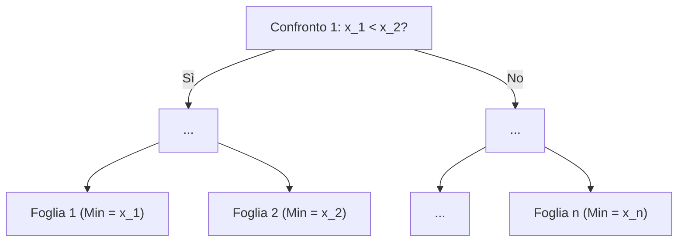

## Lazy Evaluation

Quando si valutano espressioni booleane con connettivi logici `AND` ($\land$) e `OR` ($\lor$), i linguaggi di programmazione adottano una **lazy evaluation** (valutazione pigra) per ottimizzare l'esecuzione:

```cpp
bool u = (a && b && c) || (!a && !b && !c);
```

In particolare si ha che:  

* **In una catena di `AND` (`&&`):** Se il primo termine e' `false`, l'intera sotto-espressione e' `false`. L'esecuzione **non prosegue** valutando i termini successivi.
* **In una catena di `OR` (`||`):** Se la prima sotto-espressione e' `true`, l'intera espressione e' `true`. L'esecuzione **non prosegue** valutando la seconda parte.

> **Nota (Leggi di De Morgan):** La negazione della prima espressione si trasforma usando le leggi di De Morgan:
> $$\neg(a \land b \land c) \equiv \neg a \lor \neg b \lor \neg c$$

---

## Metodo dei *"quadrati ripetuti"*

Il metodo dei "quadrati ripetuti" (o *exponentiation by squaring*) riduce drasticamente il numero di moltiplicazioni necessarie per calcolare $x^n$.

### Calcolo di $x^8$

* **Approccio intuitivo:** $x \cdot x \cdot x \cdot x \cdot x \cdot x \cdot x \cdot x$ $\rightarrow$ **7 moltiplicazioni**.
* **Quadrature Successive:**
  ```cpp
  int x2 = x * x;   // 1ª moltiplicazione: x^2
  int x4 = x2 * x2; // 2ª moltiplicazione: x^4
  int x8 = x4 * x4; // 3ª moltiplicazione: x^8
  ```

In questo modo si eseguono soltanto **$3$ moltiplicazioni al posto di $7$** (o $8$ passaggi). In generale il numero di operazioni scende in modo considerevole.

---

## Esercizio: Bersaglio (ottimizzazione geometrica)

Dato un punto $P = (x, y)$ e un cerchio con centro nell'origine $O = (0, 0)$ e raggio $r$, si vuole verificare se $P$ e' interno al cerchio.

$$\text{Distanza: } \overline{OP} = \sqrt{x^2 + y^2}$$

> **Nota**: non e' possibile utilizzare la radice quadrata!

Elevando entrambi i membri al quadrato si ottiene la condizione equivalente:

$$\sqrt{x^2 + y^2} < r \iff x^2 + y^2 < r^2$$

```cpp
// Verifico senza radici quadrate:
bool dentro = (x * x + y * y) < (r * r);
```

---

## Esercizio: Scatole (divisione intera per eccesso)

Dati $n$ oggetti e la capienza $k$ di una scatola ($n \ge 0, k > 0$), calcolare:
1. Il numero minimo di scatole necessarie ($\lceil n/k \rceil$).
2. Il numero di posti rimasti vuoti nell'ultima scatola.

```c
int scatole = (n + k - 1) / k;
int vuoti = (k * scatole) - n;
```

### Perche `(n + k - 1) / k`?
La divisione intera standard effettua il troncamento verso il basso (floor $\lfloor n/k \rfloor$). Aggiungendo $(k - 1)$ al numeratore, qualsiasi resto $R > 0$ fara' scattare il quoziente intero al valore successivo, mentre se $n$ e' un multiplo esatto di $k$, la quantita' $(k-1)$ non basta a incrementare il quoziente.

---

## Limiti inferiori e alberi di decisione

Quante operazioni deve fare al caso pessimo un algoritmo basato su confronti per individuare la risposta corretta?

Un algoritmo basato su confronti binari puo' essere modellato come un **albero di decisione**, in cui:
* Le **foglie** rappresentano le soluzioni possibili ($\#\text{Soluzioni}$).
* L'**altezza dell'albero** $t$ rappresenta il numero di confronti nel caso pessimo.

Poiche' un albero binario di altezza $t$ ha al massimo $2^t$ foglie (rami di computazione):

$$\#\text{Casi} (2^t) \ge \#\text{Soluzioni}$$

### Esempio Pratico
Se un problema ha $6$ possibili soluzioni distinte:

$$2^t \ge 6 \implies t \ge \log_2 6 \approx 2.58 \implies t \ge 3 \text{ confronti}$$

---

## Ricerca del minimo tra $n$ elementi

Vogliamo trovare l'elemento minimo all'interno di un insieme di $n$ elementi mediante confronti.

* **Numero di soluzioni possibili:** $n$ (qualsiasi elemento puo' essere il minimo).
* **Disuguaglianza teorica:**
  $$2^t \ge n \implies t \ge \log_2 n$$



### Domanda Fondamentale
$\log_2 n$ confronti sono **necessari**, ma sono anche **sufficienti**?

> **Risposta:** No, $\log_2 n$ e' solo un limite inferiore ideale che non tiene conto della struttura del problema. E' possibile infatti dimostrare che a seconda del problema per essere certi di aver trovato il minimo servono effettivamente **$n - 1$ confronti**.


### Dove $\log_2 n$ FUNZIONA: 

Trovare un numero in un elenco ordinatoEsempio: Hai la lista ordinata `[10, 20, 30, 40, 50, 60, 70, 80]` ($n = 8$) e cerchi il 70.Come funziona: Guardi il valore al centro (40). Siccome $70 > 40$, scarti in un colpo solo meta' elenco (10, 20, 30, 40). Risultato: Ogni confronto dimezza le opzioni. Servono al massimo $\log_2(8) = \mathbf{3}$ confronti.2.  

### Dove $\log_2 n$ NON FUNZIONA:  

Trovare il minimo in un elenco disordinatoEsempio: Hai i numeri casuali `[42, 12, 89, 5]` ($n = 4$) e vuoi trovare il minimo. Perche' non funziona: Se confronti due numeri (es. $42$ e $12$), scopri solo che $12$ e' piu' piccolo, ma non impari nulla sugli altri numeri ($89$ e $5$). Non puoi mai dimezzare l'elenco. Risultato: Teoricamente $\log_2(4) = 2$, ma per escludere con certezza gli altri 3 candidati devi per forza fare $n - 1 = \mathbf{3}$ confronti.