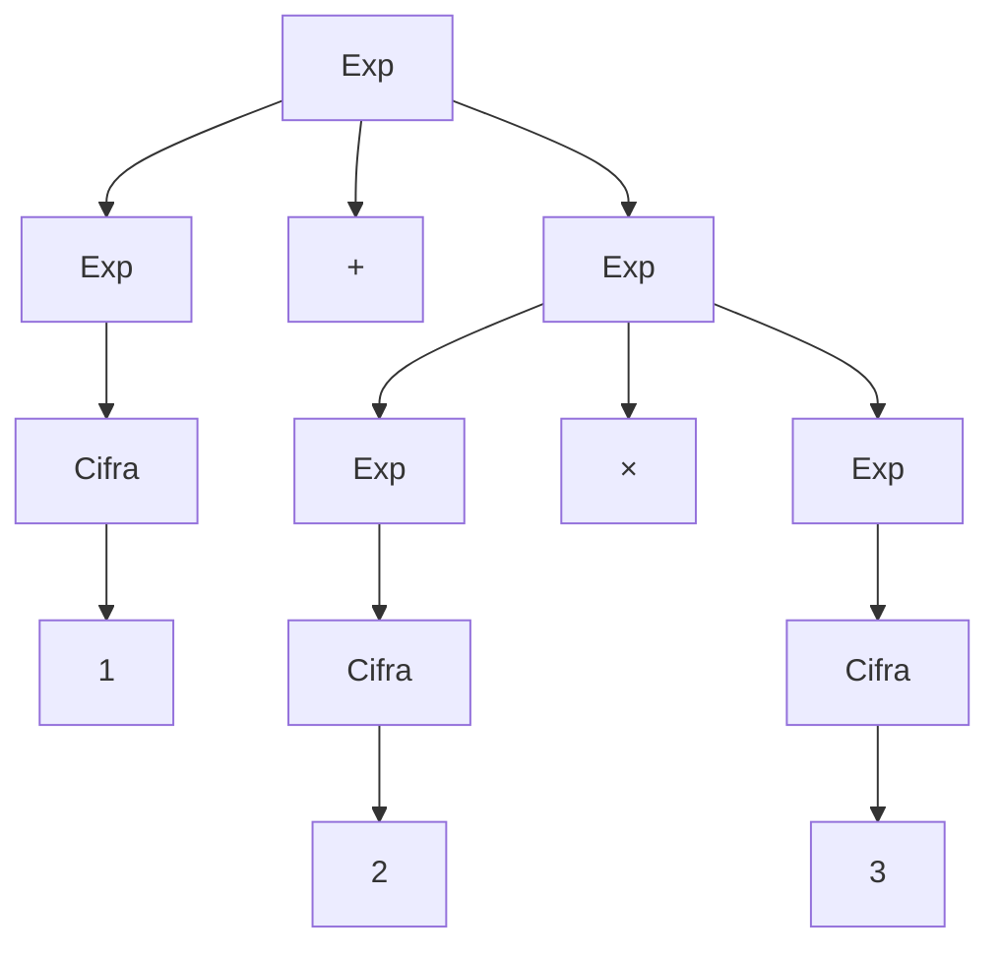
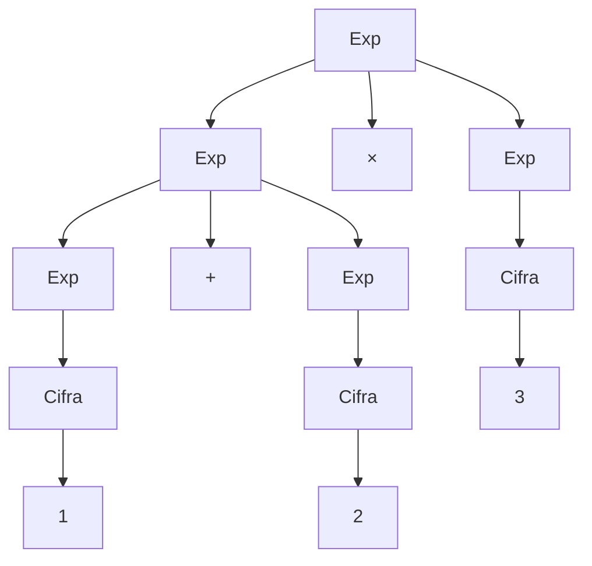
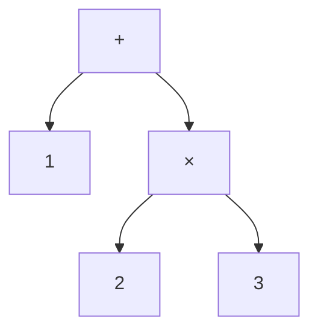

## Grammatica

Si ricorda che una grammatica è una terna:

$$G = (T, N, P)$$

dove:

- $N$ è l'insieme dei simboli non terminali;
- $T$ è l'insieme dei simboli terminali;
- $P$ è l'insieme delle produzioni.

L'insieme delle produzioni e' invece:  

$P \subseteq S^* \times S^*$  

Dove $S = T \cup N$  

Una produzione ha la forma:

$$X ::= \beta$$

dove $X \in N$ è un simbolo non terminale e $\beta$ è una stringa di simboli terminali e non terminali.

## Grammatica per espressioni aritmetiche

```text
Op  ::= + | ×
Exp ::= Num | Exp Op Exp
```

## Derivativo  

Un simbolo $a^\prime$ si dice derivativo se da $a$ e'possibile ottenere $a^\prime$ applicando un numero qualsiasi di produzioni.   

$$\alpha \Rightarrow \alpha_1 \Rightarrow \alpha_2 \Rightarrow \dots \Rightarrow \alpha_n = \alpha'$$

## Derivativo immediato

Date due stringhe $a, a^\prime \in S^*$ si dice che $a^\prime$ e' un derivativo immediato di $a$ se da $a$ e' possibile ottenere $a^\prime$ applicando una singola produzione.  

Si indica con $\alpha \Rightarrow \alpha'$ l'applicazione di una sola produzione.

Esempio:

```text
a = Exp + Exp Op 2  ⇒  a' = Exp + Num Op2
```

## Linguaggio generato

Dato $G = (T, N, P)$ e un simbolo non terminale $X \in N$, il linguaggio di $X$ scritto $\mathcal{L}(X)$ e' l'insieme di tutti e soli i derivativi:

$$\mathcal{L}(X) = \{w \mid w \in T^* \text{ e } X \rightsquigarrow^* w\}$$

> $L(X)$ è l'insieme di tutte le stringhe $\omega$ formate da soli simboli terminali $T$ tali per cui è possibile derivare $\omega$ partendo dal simbolo $X$ in zero o più passaggi di derivazione $\rightsquigarrow$

## Quali stringhe appartengono al linguaggio ?  

Data la grammatica $G$ e una stringa di terminali $\omega \in T^*$ appartiene al linguaggio $\mathcal{L}(X)$ del non terminale $X \in N^*$ se:  

> partendo dal simbolo $X$ e applicando una o piu' regole di produzione, passo dopo passo si ottiene la stringa $\omega \in T^*$ composta solo da terminali.  

### Esempio  

```text
B ::= 1 | 0B | 1B
```

La stringa `1001` appartiene al linguaggio ?

$$B \Rightarrow 1B \Rightarrow 10B \Rightarrow 100B \Rightarrow 1001$$

La stringa `1000` non appartiene al linguaggio, perché ogni derivazione deve terminare con `1`.

## Esempi di grammatiche

Consideriamo la grammatica:

```text
S ::= AB
A ::= aA | a
B ::= bB | b
```

Questa grammatica genera il linguaggio delle stringhe sull'alfabeto
$\{a,b\}$ che contengono una o più `a`, seguite da una o più `b`:

$$\mathcal{L}(S) = \{a^n b^m \mid n > 0,\ m > 0\}$$

Per esempio, `aabbb` appartiene al linguaggio.

## Numeri naturali

Per definire i numeri naturali si può introdurre il concetto di cifra diversa da zero, così da evitare gli zeri iniziali:

```text
NONZERO ::= 1 | 2 | 3 | ... | 9
CIFRA   ::= 0 | NONZERO
NUM     ::= NONZERO | NUM CIFRA
```

Ma cosi' non e' piu' possibile scrivere solo lo zero, allora introduciamo POS:

```text
POS ::= NONZERO | POS CIFRA
NUM ::= 0 | POS
```

In questo modo `0` è l'unico numero che può essere scritto con una sola cifra zero; non è possibile scrivere numeri come `00` o `01`.

## Derivazioni canoniche

Una derivazione canonica sinistra sostituisce sempre il simbolo non terminale più a sinistra. Una derivazione canonica destra sostituisce sempre il simbolo non terminale più a destra. Le due strategie possono produrre la stessa stringa seguendo ordini diversi di applicazione delle produzioni.

## Esempio di derivazione

Consideriamo:

```text
Exp ::= Exp + Exp | Exp × Exp | Cifra
Cifra ::= 1 | 2 | 3 | ...
```

La stringa `1 + 2 × 3` può essere derivata così:

```text
Exp
⇒ Exp + Exp
⇒ Cifra + Exp
⇒ 1 + Exp
⇒ 1 + Exp × Exp
⇒ 1 + Cifra × Exp
⇒ 1 + 2 × Exp
⇒ 1 + 2 × Cifra
⇒ 1 + 2 × 3
```

Abbiamo verificato che $1+2\times 3 \in \mathcal{L}(\text{Exp})$  


## Alberi di derivazione (parse tree)

Un albero di derivazione rappresenta graficamente una derivazione: la radice (o genitore) è il simbolo iniziale, i nodi interni sono simboli non terminali e le foglie sono simboli terminali.

Per l'interpretazione $1 + (2 \times 3)$:



Per l'interpretazione $(1 + 2) × 3$:



## Ambiguità

Una grammatica è ambigua se esiste una stringa del linguaggio ottenibile tramite due alberi sintattici diversi. La grammatica delle espressioni precedente è ambigua: `1 + 2 × 3` può essere interpretata come:

$$\left(1 + 2\right) \times 3$$

oppure come:

$$1 + \left(2 \times 3\right)$$

Per eliminare l'ambiguità occorre stabilire le precedenze degli operatori e la loro associatività.

## AST — Abstract Syntax Tree

L'albero di sintassi astratta conserva soltanto la struttura essenziale dell'espressione e rimuove i nodi non necessari, come quelli corrispondenti a `Exp` e `Cifra`.

La valutazione di un'espressione o di un programma rappresentato tramite un albero sintattico procede partendo dai nodi più profondi (le foglie) per risalire progressivamente verso la radice. Per `1 + 2 × 3`, assumendo che `×` abbia precedenza maggiore di `+`:



Si valuta prima il sottoalbero `2 × 3`, poi si applica la somma con `1`.
