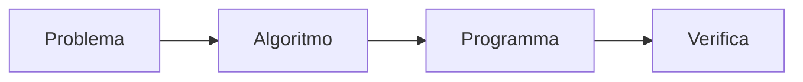
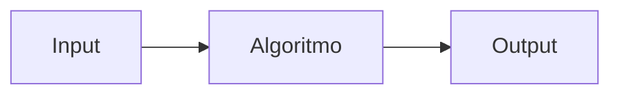
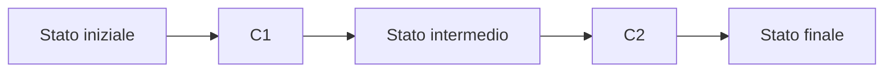

## Fasi della programmazione

La realizzazione di un programma può essere schematizzata come segue:



Le fasi principali sono:

1. **Specificazione del problema**: comprensione del problema, individuazione dei dati disponibili e definizione del risultato richiesto.
2. **Progettazione dell'algoritmo**: descrizione del procedimento risolutivo.
3. **Codifica**: traduzione dell'algoritmo in un programma.
4. **Esecuzione e verifica**: esecuzione del programma e controllo del risultato, anche tramite monitoraggio ed eventuale correzione degli errori.

## 1. Specifica del problema

La specifica deve indicare:

- i **dati iniziali** disponibili e gli input;
- il **risultato** o output richiesto;
- i **vincoli** e le condizioni da rispettare.

### Esempio: indovinare un numero

Si vuole giocare a indovinare il numero scelto dal programma, compreso tra 1 e 1000.

- **Input** - un numero nell'intervallo $[1, 1000]$, con $N = 1000$ possibilità iniziali;
- **Output** - il numero di tentativi necessari per indovinare il numero.
- **Condizioni** - Una risposta per tentativo: basso, alto o esatto. Solo numeri interi e risposte sempre corrette.

## 2. Progettazione dell'algoritmo

Per essere utilizzabile, un algoritmo deve essere:

- **finito**;
- **eseguibile**;
- **non ambiguo**.

La struttura generale è:



### Ricerca binaria

Per bilanciare il numero di passi in ogni ramo conviene scegliere ogni volta il valore centrale dell'intervallo corrente.

| Tentativo | Numero proposto | Se il numero è più basso | Se il numero è più alto |
|---:|---:|---:|---:|
| 1 | 500 | intervallo $[1,499]$ | intervallo $[501,1000]$ |
| 2 | 250 o 750 | si dimezza nuovamente l'intervallo | si dimezza nuovamente l'intervallo |
| ... | ... | ... | ... |

Il numero di possibilità rimane sempre la metà rispetto al tentativo precedente. Per questo il numero massimo di tentativi è dell'ordine di:

$$
\log_2 N
$$

Per $N=1000$ servono al massimo 10 tentativi.  


|Tentativi|1|2|3|4|5|6|7|8|9|10|
|-|-|-|-|-|-|-|-|-|-|-|
|Candidati|1000|500|250|125|62|31|15|7|3|1|


Perche' funziona ?

* il numero da indovinare rimane sempre nell'intervallo ammissibile (*correttezza*)
* ogni tentativo sbagliato elimina un candidato (*terminazione*)
* ogni tentativo elimina circa la meta' dei candidati (*efficienza*)

### Formalizzazione della strategia

```text
INF = 1                 // estremo inferiore
SUP = 1000              // estremo superiore
NUMERO = (INF + SUP) / 2 // divisione intera
TENTATIVI = 1
```

In base alla risposta:

| Risposta | Aggiornamento |
|---|---|
| **Basso** | `INF = NUMERO + 1` |
| **Alto** | `SUP = NUMERO - 1` |
| **Esatto** | si comunica che il numero è stato indovinato |

# MiniMao  

Per la codifica dobbiamo introdurre lo pseudolinguaggio di programmazione **Mao** che per il momento vedremo in versione ridotta, ovvero **MiniMao**.   

### Variabili

Una variabile è uno spazio di memoria identificato da un nome, nel quale viene conservato un valore. Il nome permette di riferirsi alla variabile e di ottenere o modificare il valore durante l'esecuzione.

La **dichiarazione** di una variabile comprende:

- il **nome**;
- il **tipo**.

Esempio:

```minimao
INT eta;
BOOL studente;
```

### Elementi sintattici

Il linguaggio MINIMAO comprende:

- **valori** $V$ (interi e booleani $\mathbb{Z} \cap \mathbb{B}$)
- **identificatori** $Id$ (nomi di variabili; non possono essere parole riservate)
- **espressioni** $E$ (combinazioni di valori, identificatori e operatori che producono un valore);
- **tipi** $T$
- **comandi** $C$

L'insieme dei valori interi, ad esempio, può essere indicato come:

$$
V = \{\ldots,-1,0,1,2,\ldots\}
$$

Gli identificatori, per esempio `mio_id1`, sono stringhe alfanumeriche che iniziano con una lettera minuscola.

Un'espressione è una combinazione di valori, identificatori e operatori che produce un valore:

$$
E ::= V \mid E \mid Id \mid uop\ E \mid E\ bop\ E
$$

Gli operatori possono essere unari ($uop$) o binari ($bop$).  

### Operatori unari

| Operatore | Funzione | Tipo |
|---|---|---|
| `-` | cambia il segno | $\mathbb{Z} \to \mathbb{Z}$ |
| `!` | negazione logica | $\mathbb{B} \to \mathbb{B}$ |

### Operatori binari

| Operatore | Funzione | Tipo |
|---|---|---|
| `+` | somma | $\mathbb{Z}\times\mathbb{Z}\to\mathbb{Z}$ |
| `-` | differenza | $\mathbb{Z}\times\mathbb{Z}\to\mathbb{Z}$ |
| `*` | prodotto | $\mathbb{Z}\times\mathbb{Z}\to\mathbb{Z}$ |
| `<` | confronto | $\mathbb{Z}\times\mathbb{Z}\to\mathbb{B}$ |
| ... | altri operatori | ... |

La divisione non è indicata tra gli operatori mostrati perché il risultato potrebbe non essere un intero oppure potrebbe verificarsi un errore quando il divisore è zero.  La vedremo in dettaglio piu' avanti.  

### Tipi

I tipi possono essere:  

- **tipi base**, come `INT` e `BOOL`;
- **tipi composti**, come array e altri costrutti.

```text
Tb ::= INT | BOOL 
T ::= Tb | Tc
```

Di default, le variabili hanno un valore iniziale dipendente dal tipo, se non viene assegnato esplicitamente:

- `0` per `INT`;
- `FALSE` per `BOOL`.

Per decidere quali espressioni sono ben formate useremo il sistema di tipi. Ad esempio `FALSE + 5` non è un'espressione valida.  

## Comandi

I comandi fondamentali sono:

| Forma | Significato |
|---|---|
| `skip;` | comando vuoto, non fa nulla |
| `T Id;` | **dichiarazione** della variabile `Id` di tipo `T`, con valore di default |
| `T Id = E;` | dichiarazione con **inizializzazione** al valore dell'espressione `E` |
| `Id = E;` | **assegnamento** |
| `C C` | composizione sequenziale |
| `{ C }` | blocco di comandi |

```text
C ::= skip;
    | T Id;
    | T Id = E;
    | Id := E;
    | CC
    | {C}
```

### Stato del programma

Lo **stato** è l'insieme di tutte le variabili e dei rispettivi valori in un certo punto del programma.

Ad esempio dopo:  

```text
INT eta;
INT studente = true;
```

lo stato contiene `eta = 0` e `studente = true`.

Un assegnamento modifica il valore di una variabile già dichiarata:

```text
eta := eta + 1;
```

L'esecuzione dei comandi deve andare a buon fine e il risultato deve rispettare i tipi.

La sequenza dei comandi può essere rappresentata così:



## Esempio: area e perimetro di un rettangolo

Dato un rettangolo di base $b$ e altezza $h$, calcolare perimetro e area.

```minimao
INT p;
INT a;

p = 2 * (b + h);
a = b * h;
```
