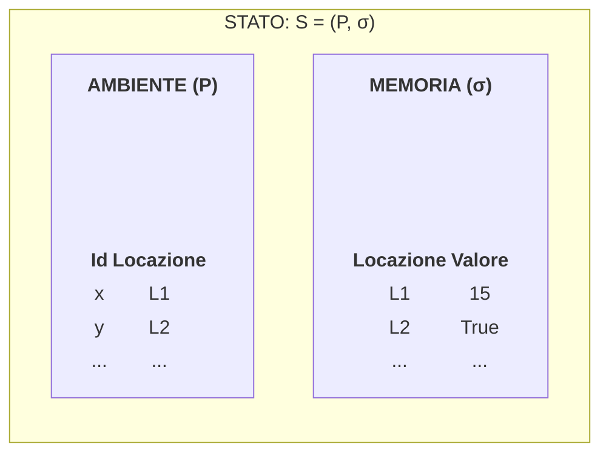

## Conversione del tempo

Per convertire un tempo espresso in ore, minuti e secondi nel numero totale di secondi:

~~~c
int tot_sec = sec + 60 * min + 3600 * ore;
~~~

## Scambio di variabili

L'assegnamento è **distruttivo**: il valore precedente della variabile a sinistra viene perso.

Se `x = 1` e `y = 2`, il codice seguente non scambia i valori al contrario di quanto potrebbe sembrare ad un occhio inesperto:  

```text
y = x;
x = y;
```

Dopo le due istruzioni si ottiene `x = 1` e `y = 1`.

È necessario usare una variabile temporanea:

~~~c
int temp = y;
y = x;
x = temp;
~~~

## Esercizio: maggioranza

Date tre votazioni booleane `a`, `b` e `c`, la maggioranza è vera se almeno due voti su tre sono favorevoli.

~~~c
bool m = (a && b) || (b && c) || (a && c);
~~~

# Ambiente e memoria

Si dice **ambiente** la funzione parziale dagli identificatori alle locazioni:

$$\rho : \text{Identificatori} \rightharpoonup \text{Locazioni}$$

Si dice **memoria** la funzione parziale che associa a ogni locazione un valore:

$$\sigma : \text{Locazioni} \rightharpoonup \text{Valori}$$




Il valore di `x` è quindi $σ(ρ(x)) = 15$, mentre il valore di `y` è $σ(ρ(y)) = \text{true}$.


Lo **stato** è una coppia ambiente–memoria:

$$s = (\rho, \sigma)$$

Ad esempio:

$$\rho = [x \mapsto L_x,\ y \mapsto L_y]$$

$$\sigma = [L_x \mapsto 1,\ L_y \mapsto 2]$$

L'assegnamento modifica la memoria, non l'ambiente.

~~~c
y := x;
~~~

produce:

$$\sigma' = [L_x \mapsto 1,\ L_y \mapsto 1]$$

Cosi' come:

~~~c
y = y + 1;
~~~

aggiorna il valore contenuto nella locazione di y:

$$\sigma'' = [L_x \mapsto 1,\ L_y \mapsto 2]$$

Mentre:

```c
INT t;
```

Cambia l'ambiente e la memoria inserendo un nuovo identificatore con il relativo valore.  

$$\rho' = [x \mapsto L_x,\ y \mapsto L_y,\ t \mapsto L_t]$$  
$$\sigma''' = [L_x \mapsto 1,\ L_y \mapsto 2,\ L_t \mapsto 0]$$  


## Comando condizionale

I comandi condizionali servono per prendere decisioni in base al valore di una proposizione booleana.

La forma generale è:

~~~c
if (E) {
    C1
} else {
    C2
}
~~~

Se `E` è vera viene eseguito `C1`; se `E` è falsa viene eseguito `C2`.

~~~mermaid
flowchart TD
    A{E è vera?} -->|Sì| B[esegui C1]
    A -->|No| C[esegui C2]
    B --> D[continua]
    C --> D
~~~

### Blocchi di comandi

Le parentesi graffe delimitano un blocco di comandi:

~~~c
if (E) {
    C1;
    C2;
    C3;
} else {
    C4;
}
~~~

### Comando if-then

Quando non è necessario specificare cosa fare nel caso falso, si può omettere il ramo else:

~~~c
if (E) {
    C1;
}
~~~

## Esercizio: anno bisestile

Un anno è bisestile se è divisibile per 4 ma non per 100, oppure se è divisibile per 400.

~~~c
bool bis = false;
bis = ((anno % 4 == 0 && anno % 100 != 0) || (anno % 400 == 0));
~~~

In forma matematica:

$$\operatorname{bisestile}(anno) \iff
\bigl(anno \bmod 4 = 0 \land anno \bmod 100 \ne 0\bigr)
\lor \bigl(anno \bmod 400 = 0\bigr)$$
